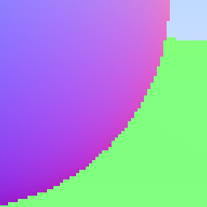
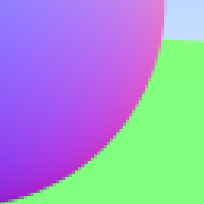

If you look closely at the images we are producing you will see an effect known as "[jaggies](https://en.wikipedia.org/wiki/Jaggies)":



We can use antialiasing to help smooth these edges, and make our image more realistic.

Antialiasing works by averaging multiple random samples for each pixel.

### Some Random Number Utilities

First we need to generate some random numbers.
To easily access a random number generator in Rust we add a crate to our `Cargo.toml`:

```toml
[package]
name = "ray-tracing-in-one-weekend-with-rust"
version = "0.1.0"
authors = ["austind"]
edition = "2018"

# See more keys and their definitions at https://doc.rust-lang.org/cargo/reference/manifest.html

[dependencies]
rand = "0.7.3" // highlight-line
```

There is a good chance in the future we will replace this random number generator with something a bit faster.
To help when that time comes we will define a few utility functions:

```rust{numberLines: true}
pub fn random() -> f64 {
    thread_rng().gen()
}

#[allow(dead_code)]
pub fn random_range(min: f64, max: f64) -> f64 {
    thread_rng().gen_range(min, max)
}
```

### Generating Pixels with Multiple Samples

First let's move our camera code into an independent `struct`:

```rust{numberLines: true}
pub struct Camera {
    pub origin: Point3,
    pub lower_left_corner: Point3,
    pub horizontal: Vec3,
    pub vertical: Vec3,
}

impl Camera {
    pub fn new(aspect_ratio: f64, viewport_height: f64, focal_length: f64, origin: Point3) -> Camera {
        let viewport_width = aspect_ratio * viewport_height;
        let horizontal = Vec3::new(viewport_width, 0.0, 0.0);
        let vertical = Vec3::new(0.0, viewport_height, 0.0);
        Camera {
            origin,
            horizontal,
            vertical,
            lower_left_corner: origin - horizontal / 2.0 - vertical / 2.0 - Vec3::new(0.0, 0.0, focal_length),
        }
    }

    pub fn get_ray(&self, u: f64, v: f64) -> Ray {
        Ray::new(self.origin, self.lower_left_corner + u * self.horizontal + v * self.vertical - self.origin)
    }
}
```

Then update our `write_color` function to average out our pixel color:

```rust{numberLines: true}
fn clamp(x: f64, min: f64, max: f64) -> f64 { // highlight-line
    if x < min { // highlight-line
        min // highlight-line
    } else if x > max { // highlight-line
        max // highlight-line
    } else { // highlight-line
        x // highlight-line
    } // highlight-line
} // highlight-line

pub fn write_color(f: &mut impl Write, color: Color, samples_per_pixel: u32) -> std::io::Result<()> { // highlight-line
    let scale = 1.0 / samples_per_pixel as f64; // highlight-line

    let r = color.x() * scale; // highlight-line
    let g = color.y() * scale; // highlight-line
    let b = color.z() * scale; // highlight-line

    write!(
        f,
        "{} {} {}\n",
        (256.0 * clamp(r, 0.0, 0.999)) as u32, // highlight-line
        (256.0 * clamp(g, 0.0, 0.999)) as u32, // highlight-line
        (256.0 * clamp(b, 0.0, 0.999)) as u32, // highlight-line
    )
}
```

Then update `main`:

```rust{numberLines: true}
fn main() {
    let aspect_ratio = 16.0 / 9.0; // highlight-line

    let image_width = 400; // highlight-line
    let image_height = (image_width as f64 / aspect_ratio) as u32; // highlight-line
    let samples_per_pixel = 100; // highlight-line

    let mut world = HittableList::new();
    world.add(Rc::new(Sphere::new(Point3::new(0.0, 0.0, -1.0), 0.5)));
    world.add(Rc::new(Sphere::new(Point3::new(0.0, -100.5, -1.0), 100.0)));
    let world = world;

    let cam = Camera::new(aspect_ratio, 2.0, 1.0, Point3::new(0.0, 0.0, 0.0)); // highlight-line

    print!("P3\n{} {}\n255\n", image_width, image_height);

    for j in (0..image_height).rev() {
        eprint!("\rScanlines remaining: {} ", j);
        for i in 0..image_width {
            let mut pixel_color = Color::new(0.0, 0.0, 0.0);
            for _ in 0..samples_per_pixel { // highlight-line
                let u = (i as f64 + random::random()) / (image_width - 1) as f64; // highlight-line
                let v = (j as f64 + random::random()) as f64 / (image_height - 1) as f64; // highlight-line
                let r = cam.get_ray(u, v); // highlight-line
                pixel_color += ray_color(&r, &world); // highlight-line
            } // highlight-line
            write_color(io::stdout().borrow_mut(), pixel_color, samples_per_pixel).unwrap(); // highlight-line
        }
    }

    eprint!("\nDone.\n");
}
```

This results in a much smoother image:




This isn't for free though!
Running the debug build takes nearly 30s, when before it was nearly instant:

```shell{outputLines: 2-3, 5-10}
cargo build
   Compiling ray-tracing-in-one-weekend-with-rust v0.1.0 (/home/austind/Documents/github.com/austindoupnik/ray-tracing-in-one-weekend-with-rust)
    Finished dev [unoptimized + debuginfo] target(s) in 0.56s
time ./target/debug/ray-tracing-in-one-weekend-with-rust > image.ppm 
Scanlines remaining: 0   
Done.

real    0m28.905s
user    0m28.387s
sys     0m0.380s
```

Luckily the release build is much faster:

```shell{outputLines: 2, 4-9}
cargo build --release
    Finished release [optimized] target(s) in 0.02s
time ./target/release/ray-tracing-in-one-weekend-with-rust > image.ppm 
Scanlines remaining: 0   
Done.

real    0m0.934s
user    0m0.776s
sys     0m0.156s
```

The complete code is [available here](https://github.com/austindoupnik/ray-tracing-in-one-weekend-with-rust/tree/v0.0.1-chapter.7).