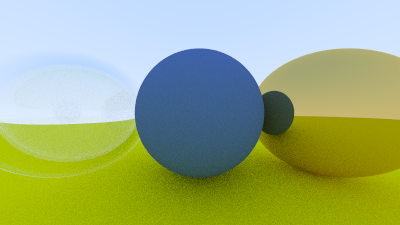

Next we add a material to represent dielectrics.
A dielectric is a transparent or semi-transparent material, rays which interact with these types of material will sometimes reflect and sometimes refract.
Refraction is different from reflection because the ray will pass through the material, but at an altered angle.

### Snell's Law

The angle of refraction can be determined from [Snell's Law](https://en.wikipedia.org/wiki/Snell%27s_law): $$\eta \cdot sin \theta = \eta^{\prime} \cdot sin \theta^{\prime}$$.

If we decompose our ray $$R^{\prime}$$ (the ray resulting from refraction) into parallel and perpendicular components projected onto $$n^{\prime}$$ we have: $$R^{\prime} = R^{\prime}_\perp + ^{\prime}_\parallel$$.

With some work (which we won't do here), we can then show that:

$$
\begin{aligned}
R^{\prime}_\perp &= \frac{\eta}{\eta^\prime} (R + cos \theta n) \\
R^{\prime}_\parallel &= -\sqrt{1 - \vert R^\prime_\perp \vert^2 } n \\
\end{aligned}
$$

Taking into account that $$a \cdot b = \vert a \vert \vert b \vert cos \theta$$ if we restrict $$a$$ and $$b$$ to unit vectors we have:

$$
R^{\prime}_\perp = \frac{\eta}{\eta^\prime} (R + (-R \cdot n) n)
$$

With this we can write a function to calculate our refracted ray:

```rust{numberLines: true}
    pub fn refract(uv: &Vec3, n: &Vec3, etai_over_etat: f64) -> Vec3 {
        let cos_theta = Vec3::dot(&-uv, n);
        let r_out_perp = etai_over_etat * (uv + cos_theta * n);
        let r_out_parallel = -f64::sqrt(f64::abs(1.0 - r_out_perp.length_squared())) * n;
        r_out_perp + r_out_parallel
    }
```

From there we can define a new `Material` for dielectrics:

```rust{numberLines: true}
pub struct Dielectric {
    ir: f64,
}

impl Dielectric {
    pub fn new(ir: f64) -> Self {
        Dielectric {
            ir,
        }
    }
}

impl Material for Dielectric {
    fn scatter(&self, r_in: &Ray, rec: &HitRecord, attenuation: &mut Color, scattered: &mut Ray) -> bool {
        *attenuation = Color::new(1.0, 1.0, 1.0);
        let refraction_ratio = if rec.front_face {
            1.0 / self.ir
        } else {
            self.ir
        };

        let unit_direction = Vec3::unit_vector(r_in.direction());
        let refracted = Vec3::refract(&unit_direction, &rec.normal, refraction_ratio);

        *scattered = Ray::new(rec.p, refracted);

        true
    }
}
```

Adding this to our world:

```rust{numberLines: true}
    let material_ground = Rc::new(Lambertian::new(Color::new(0.8, 0.8, 0.0)));
    let material_center = Rc::new(Dielectric::new(1.5)); // highlight-line
    let material_left = Rc::new(Dielectric::new(1.5)); // highlight-line
    let material_right = Rc::new(Metal::new(Color::new(0.8, 0.6, 0.2), 1.0));
```

The result:


### Total Internal Reflection

Clearly this does not look right.
One issue pointed out by the source material is that we do not often see floating orbs of glass, so having an intuition about how it should look is not easy.
A more pressing concern is that rays should not always refract.
If we refer back to Snell's Law: $$sin \theta^{\prime} = \frac{\eta}{\eta^{\prime}} \cdot sin \theta$$ and consider the case where $$\frac{\eta}{\eta^{\prime}}$$ we see that no solution can exist for $$sin \theta^\prime$$ as $$sin$$ can never produce a value greater than $$1$$.
In these cases the ray should be reflected, not refracted.

Let's update our `scatter` method:

```rust{numberLines: true}
impl Material for Dielectric {
    fn scatter(&self, r_in: &Ray, rec: &HitRecord, attenuation: &mut Color, scattered: &mut Ray) -> bool {
        *attenuation = Color::new(1.0, 1.0, 1.0);
        let refraction_ratio = if rec.front_face {
            1.0 / self.ir
        } else {
            self.ir
        };

        let unit_direction = Vec3::unit_vector(r_in.direction());
        let cos_theta = f64::min(Vec3::dot(&-unit_direction, &rec.normal), 1.0); // highlight-line
        let sin_theta = f64::sqrt(1.0 - cos_theta * cos_theta); // highlight-line

        let direction = if refraction_ratio * sin_theta > 1.0 { // highlight-line
            Vec3::reflect(&unit_direction, &rec.normal) // highlight-line
        } else { // highlight-line
            Vec3::refract(&unit_direction, &rec.normal, refraction_ratio) // highlight-line
        }; // highlight-line

        *scattered = Ray::new(rec.p, direction); // highlight-line

        true
    }
}
```

Here the source material does something I don't fully understand, which is to modify the original scene, before generating the next image.
This makes it hard to compare the results, and in fact if I render the original scene using the new method it looks the same (at least to my eyes).
Either way let's update the scene:

```rust{numberLines: true}
    let material_ground = Rc::new(Lambertian::new(Color::new(0.8, 0.8, 0.0)));
    let material_center = Rc::new(Lambertian::new(Color::new(0.1, 0.2, 0.5))); // highlight-line
    let material_left = Rc::new(Dielectric::new(1.5));
    let material_right = Rc::new(Metal::new(Color::new(0.8, 0.6, 0.2), 0.0)); // highlight-line
```

Which gives:


### Schlick Approximation

In reality the reflectivity of dielectrics will vary with the viewing angle, we can approximate this with [Schlick's approximation](https://en.wikipedia.org/wiki/Schlick%27s_approximation):

```rust{numberLines: true}
impl Dielectric {
    // ...

    fn reflectance(cosine: f64, ref_idx: f64) -> f64 { // highlight-line
        let r0 = (1.0 - ref_idx) / (1.0 + ref_idx); // highlight-line
        let r0 = r0 * r0; // highlight-line
        r0 + (1.0 - r0) * f64::powi(1.0 - cosine, 5) // highlight-line
    } // highlight-line
}

impl Material for Dielectric {
    fn scatter(&self, r_in: &Ray, rec: &HitRecord, attenuation: &mut Color, scattered: &mut Ray) -> bool {
        *attenuation = Color::new(1.0, 1.0, 1.0);
        let refraction_ratio = if rec.front_face {
            1.0 / self.ir
        } else {
            self.ir
        };

        let unit_direction = Vec3::unit_vector(r_in.direction());
        let cos_theta = f64::min(Vec3::dot(&-unit_direction, &rec.normal), 1.0);
        let sin_theta = f64::sqrt(1.0 - cos_theta * cos_theta);

        let direction = if refraction_ratio * sin_theta > 1.0 || Dielectric::reflectance(cos_theta, refraction_ratio) > random() { // highlight-line
            Vec3::reflect(&unit_direction, &rec.normal)
        } else {
            Vec3::refract(&unit_direction, &rec.normal, refraction_ratio)
        };

        *scattered = Ray::new(rec.p, direction);

        true
    }
}
```

Rendering the scene again isn't very exciting, and looks the same as the previous render.

### Modeling a Hollow Glass Sphere

We can add a new sphere with a negative radius inside of our existing glass sphere, this results in a bubble effect:

```rust{numberLines: true}
    let mut world = HittableList::new();
    world.add(Rc::new(Sphere::new(Point3::new(0.0, -100.5, -1.0), 100.0, material_ground.clone())));
    world.add(Rc::new(Sphere::new(Point3::new(0.0, 0.0, -1.0), 0.5, material_center.clone())));
    world.add(Rc::new(Sphere::new(Point3::new(-1.0, 0.0, -1.0), 0.5, material_left.clone())));
    world.add(Rc::new(Sphere::new(Point3::new(-1.0, 0.0, -1.0), -0.4, material_left.clone()))); // highlight-line
    world.add(Rc::new(Sphere::new(Point3::new(1.0, 0.0, -1.0), 0.5, material_right.clone())));
    let world = world;
```

The result:



The complete code is [available here](https://github.com/austindoupnik/ray-tracing-in-one-weekend-with-rust/tree/v0.0.1-chapter.10).