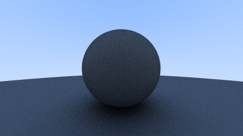
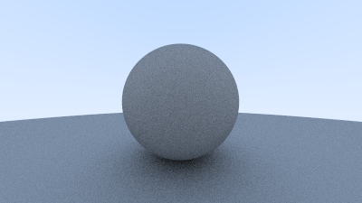
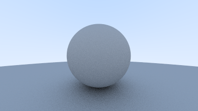
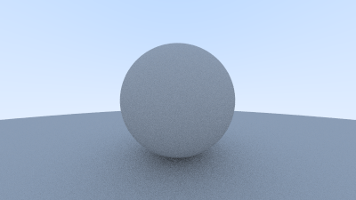

Next we will begin to introduce a critical concept, the material.
A material defines how a ray interacts with a surface.
Until now, we have used very simple models which result in images with extremely unrealistic coloring, no lighting, and lack the ability to control the material of each surface.

### A Simple Diffuse Material

We will start with a very simple approximation for a diffuse material.
Diffuse materials are materials which randomly scatter or absorb light, many every day objects are diffuse.

To start we add a few utility functions to generate random vectors:

```rust{numberLines: true}
impl Vec3 {
    // ...

    pub fn random() -> Vec3 {
        Vec3::new(random::random(), random::random(), random::random())
    }

    pub fn random_in_range(min: f64, max: f64) -> Vec3 {
        Vec3::new(random::random_in_range(min, max), random::random_in_range(min, max), random::random_in_range(min, max))
    }

    pub fn random_in_unit_sphere() -> Vec3 {
        loop {
            let p = Vec3::random_in_range(-1.0, 1.0);
            if p.length_squared() < 1.0 {
                return p;
            }
        }
    }
}
```

Then simply update our `ray_color` function with a recursive call using the new reflected ray:

```rust{numberLines: true}
fn ray_color(r: &Ray, world: &dyn Hittable) -> Color {
    let mut rec = HitRecord::new();
    if world.hit(r, 0.0, f64::INFINITY, &mut rec) {
        let target = rec.p + rec.normal + Vec3::random_in_unit_sphere(); // highlight-line
        0.5 * ray_color(&Ray::new(rec.p, target - rec.p), world) // highlight-line
    } else {
        let unit_direction = Vec3::unit_vector(r.direction());
        let t = 0.5 * (unit_direction.y() + 1.0);
        (1.0 - t) * Color::new(1.0, 1.0, 1.0) + t * Color::new(0.5, 0.7, 1.0)
    }
}
```

This results in a somewhat dark image, we will fix this later:



### Limiting the Number of Child Rays

Before we get too far ahead of ourselves there is a potential for an infinite recursion in our current implementation.
As it stands it would be possible for a ray to reflect back and forth between surfaces forever.

Let's fix that by limiting the depth, this is a fine approximation since in the real world so much energy would have been lost that reflections after a certain point contribute very little to the final color:

```rust{numberLines: true}
fn ray_color(r: &Ray, world: &dyn Hittable, depth: u32) -> Color { // highlight-line
    if depth <= 0 { // highlight-line
        return Color::new(0.0, 0.0, 0.0) // highlight-line
    } // highlight-line

    let mut rec = HitRecord::new();
    if world.hit(r, 0.0, f64::INFINITY, &mut rec) {
        let target = rec.p + rec.normal + Vec3::random_in_unit_sphere();
        0.5 * ray_color(&Ray::new(rec.p, target - rec.p), world, depth - 1) // highlight-line
    } else {
        let unit_direction = Vec3::unit_vector(r.direction());
        let t = 0.5 * (unit_direction.y() + 1.0);
        (1.0 - t) * Color::new(1.0, 1.0, 1.0) + t * Color::new(0.5, 0.7, 1.0)
    }
}

fn main() {
    let aspect_ratio = 16.0 / 9.0;

    let image_width = 400;
    let image_height = (image_width as f64 / aspect_ratio) as u32;
    let samples_per_pixel = 100;
    let max_depth = 50; // highlight-line

    let mut world = HittableList::new();
    world.add(Rc::new(Sphere::new(Point3::new(0.0, 0.0, -1.0), 0.5)));
    world.add(Rc::new(Sphere::new(Point3::new(0.0, -100.5, -1.0), 100.0)));
    let world = world;

    let cam = Camera::new(aspect_ratio, 2.0, 1.0, Point3::new(0.0, 0.0, 0.0));

    print!("P3\n{} {}\n255\n", image_width, image_height);

    for j in (0..image_height).rev() {
        eprint!("\rScanlines remaining: {} ", j);
        for i in 0..image_width {
            let mut pixel_color = Color::new(0.0, 0.0, 0.0);
            for _ in 0..samples_per_pixel {
                let u = (i as f64 + random::random()) / (image_width - 1) as f64;
                let v = (j as f64 + random::random()) as f64 / (image_height - 1) as f64;
                let r = cam.get_ray(u, v);
                pixel_color += ray_color(&r, &world, max_depth); // highlight-line
            }
            write_color(io::stdout().borrow_mut(), pixel_color, samples_per_pixel).unwrap();
        }
    }

    eprint!("\nDone.\n");
}
```

### Using Gamma Correction for Accurate Color Intensity

As previously mentioned our image is a bit dark, this is because we need to account for gamma correction.
Gamma correction is a concept I don't fully understand, but it has to do with how we perceive brightness, how monitors display colors, how we map non-linear functions to linear values.
Suffice to say we can fix our brightness problem with a small change:

```rust{numberLines: true}
pub fn write_color(f: &mut impl Write, color: Color, samples_per_pixel: u32) -> std::io::Result<()> {
    let scale = 1.0 / samples_per_pixel as f64;

    let r = f64::sqrt(color.x() * scale); // highlight-line
    let g = f64::sqrt(color.y() * scale); // highlight-line
    let b = f64::sqrt(color.z() * scale); // highlight-line

    write!(
        f,
        "{} {} {}\n",
        (256.0 * clamp(r, 0.0, 0.999)) as u32,
        (256.0 * clamp(g, 0.0, 0.999)) as u32,
        (256.0 * clamp(b, 0.0, 0.999)) as u32,
    )
}
```

From this we get an image which looks much better:



### Fixing Shadow Acne

Looking closely at the image you will probably see many small black pixels, this is due to a small bug in the original code.
This is caused by problems with floating-point approximation very close to the surface, this can be avoided by setting `t_min` to a very small value instead of `0`:

```rust{numberLines: true}
fn ray_color(r: &Ray, world: &dyn Hittable, depth: u32) -> Color {
    if depth <= 0 {
        return Color::new(0.0, 0.0, 0.0)
    }

    let mut rec = HitRecord::new();
    if world.hit(r, 0.001, f64::INFINITY, &mut rec) { // highlight-line
        let target = rec.p + rec.normal + Vec3::random_in_unit_sphere();
        0.5 * ray_color(&Ray::new(rec.p, target - rec.p), world, depth - 1)
    } else {
        let unit_direction = Vec3::unit_vector(r.direction());
        let t = 0.5 * (unit_direction.y() + 1.0);
        (1.0 - t) * Color::new(1.0, 1.0, 1.0) + t * Color::new(0.5, 0.7, 1.0)
    }
}
```



### True Lambertian Reflection

The current approximation we are using for Lambertian has a higher probability of reflecting rays near the surface normal than a true Lambertian distribution.
To correct this we modify the approach for generating reflection rays:

```rust{numberLines: true}
impl Vec3 {
    // ...
    pub fn random_unit_vector() -> Vec3 {
        let a = random_in_range(0.0, 2.0 * f64::consts::PI);
        let z = random_in_range(-1.0, 1.0);
        let r = f64::sqrt(1.0 - z * z);
        Vec3::new(r * f64::cos(a), r * f64::sin(a), z)
    }
}
```

Our `ray_color` function:

```rust{numberLines: true}
fn ray_color(r: &Ray, world: &dyn Hittable, depth: u32) -> Color {
    if depth <= 0 {
        return Color::new(0.0, 0.0, 0.0)
    }

    let mut rec = HitRecord::new();
    if world.hit(r, 0.001, f64::INFINITY, &mut rec) {
        let target = rec.p + rec.normal + Vec3::random_unit_vector(); // highlight-line
        0.5 * ray_color(&Ray::new(rec.p, target - rec.p), world, depth - 1)
    } else {
        let unit_direction = Vec3::unit_vector(r.direction());
        let t = 0.5 * (unit_direction.y() + 1.0);
        (1.0 - t) * Color::new(1.0, 1.0, 1.0) + t * Color::new(0.5, 0.7, 1.0)
    }
}
```

The differences in the result are subtle, and most noticeable by looking at the shadows:



### An Alternative Diffuse Formulation

For now, I will skip this section, it presents another _less accurate_ approximation for Lambertian surfaces.
When we get to the chapter which adds an abstraction for materials we may revisit and add each of these approximations, so we can see their effect on more complex scenes.

The complete code is [available here](https://github.com/austindoupnik/ray-tracing-in-one-weekend-with-rust/tree/v0.0.1-chapter.8).