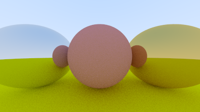
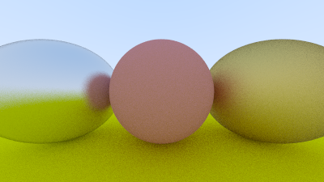

In the [Metal](https://raytracing.github.io/books/RayTracingInOneWeekend.html#metal) chapter we will introduce a new abstraction for materials, in addition to a new material for metal.

To start we need a new `trait` allowing us to define a material:

```rust{numberLines: true}
pub trait Material {
    fn scatter(&self, r_in: &Ray, rec: &HitRecord, attenuation: &mut Color, scattered: &mut Ray) -> bool;
}
```
We update our `HitRecord` to reference the `Material` that was hit, in Rust we cannot have uninitialized references so we use the `Option` type:

```rust{numberLines: true}
pub struct HitRecord {
    pub p: Point3,
    pub normal: Vec3,
    pub mat_ptr: Option<Rc<dyn Material>>, // highlight-line
    pub t: f64,
    pub front_face: bool,
}
```

Let's update our `Sphere` to have a `Material` reference as well:

```rust{numberLines: true}
pub struct Sphere {
    pub center: Point3,
    pub radius: f64,
    pub mat_ptr: Rc<dyn Material>, // highlight-line
}

impl Sphere {
    pub fn new(center: Point3, radius: f64, mat_ptr: Rc<dyn Material>) -> Sphere { // highlight-line
        Sphere {
            center,
            radius,
            mat_ptr, // highlight-line
        }
    }
}

impl Hittable for Sphere {
    fn hit(&self, r: &Ray, t_min: f64, t_max: f64, rec: &mut HitRecord) -> bool {
        let oc = r.origin() - self.center;
        let a = r.direction().length_squared();
        let half_b = Vec3::dot(oc, r.direction());
        let c = oc.length_squared() - self.radius * self.radius;
        let discriminant = half_b * half_b - a * c;

        if discriminant > 0.0 {
            let root = f64::sqrt(discriminant);

            let temp = (-half_b - root) / a;
            if temp < t_max && temp > t_min {
                rec.t = temp;
                rec.p = r.at(rec.t);
                let outward_normal = (rec.p - self.center) / self.radius;
                rec.set_face_normal(r, &outward_normal);
                rec.mat_ptr = Some(self.mat_ptr.clone()); // highlight-line
                return true;
            }

            let temp = (-half_b + root) / a;
            if temp < t_max && temp > t_min {
                rec.t = temp;
                rec.p = r.at(rec.t);
                let outward_normal = (rec.p - self.center) / self.radius;
                rec.set_face_normal(r, &outward_normal);
                rec.mat_ptr = Some(self.mat_ptr.clone()); // highlight-line
                return true;
            }
        }

        return false;
    }
}
```

Next we add a `Material` representing our existing Lambertian material:

```rust{numberLines: true}
pub struct Lambertian {
    albedo: Color,
}

impl Lambertian {
    pub fn new(albedo: Color) -> Self {
        Lambertian {
            albedo
        }
    }
}

impl Material for Lambertian {
    fn scatter(&self, _r_in: &Ray, rec: &HitRecord, attenuation: &mut Color, scattered: &mut Ray) -> bool {
        let scatter_direction = rec.normal + Vec3::random_unit_vector();
        *scattered = Ray::new(rec.p, scatter_direction);
        *attenuation = self.albedo;

        true
    }
}
```

Our new `Material` representing a shiny and reflective metal:

```rust{numberLines: true}
pub struct Metal {
    albedo: Color,
}

impl Metal {
    pub fn new(albedo: Color) -> Self {
        Metal {
            albedo
        }
    }
}

impl Material for Metal {
    fn scatter(&self, r_in: &Ray, rec: &HitRecord, attenuation: &mut Color, scattered: &mut Ray) -> bool {
        let reflected = Vec3::reflect(&Vec3::unit_vector(r_in.direction()), &rec.normal);
        *scattered = Ray::new(rec.p, reflected);
        *attenuation = self.albedo;

        Vec3::dot(scattered.direction(), rec.normal) > 0.0
    }
}
```

Finally, the updated `ray_color` function:

```rust{numberLines: true}
fn ray_color(r: &Ray, world: &dyn Hittable, depth: u32) -> Color {
    if depth <= 0 {
        return Color::new(0.0, 0.0, 0.0)
    }

    let mut rec = HitRecord::new();
    if world.hit(r, 0.001, f64::INFINITY, &mut rec) {
        let mut scattered = Ray::new(Point3::new(0.0, 0.0, 0.0), Vec3::new(0.0, 0.0, 0.0)); // highlight-line
        let mut attenuation = Color::new(0.0, 0.0, 0.0); // highlight-line

        if rec.mat_ptr.as_ref().unwrap().scatter(r, &rec, &mut attenuation, &mut scattered) { // highlight-line
            attenuation * ray_color(&scattered, world, depth - 1) // highlight-line
        } else { // highlight-line
            Color::new(0.0, 0.0, 0.0) // highlight-line
        } // highlight-line
    } else {
        let unit_direction = Vec3::unit_vector(r.direction());
        let t = 0.5 * (unit_direction.y() + 1.0);
        (1.0 - t) * Color::new(1.0, 1.0, 1.0) + t * Color::new(0.5, 0.7, 1.0)
    }
}
```

### A Scene with Metal Spheres

Let's show off the new material by adding a few metal spheres to our scene:

```rust{numberLines: true}
fn main() {
    let aspect_ratio = 16.0 / 9.0;

    let image_width = 400;
    let image_height = (image_width as f64 / aspect_ratio) as u32;
    let samples_per_pixel = 100;
    let max_depth = 50;

    let material_ground = Rc::new(Lambertian::new(Color::new(0.8, 0.8, 0.0))); // highlight-line
    let material_center = Rc::new(Lambertian::new(Color::new(0.7, 0.3, 0.3))); // highlight-line
    let material_left = Rc::new(Metal::new(Color::new(0.8, 0.8, 0.8))); // highlight-line
    let material_right = Rc::new(Metal::new(Color::new(0.8, 0.6, 0.2))); // highlight-line

    let mut world = HittableList::new(); // highlight-line
    world.add(Rc::new(Sphere::new(Point3::new(0.0, -100.5, -1.0), 100.0, material_ground.clone()))); // highlight-line
    world.add(Rc::new(Sphere::new(Point3::new(0.0, 0.0, -1.0), 0.5, material_center.clone()))); // highlight-line
    world.add(Rc::new(Sphere::new(Point3::new(-1.0, 0.0, -1.0), 0.5, material_left.clone()))); // highlight-line
    world.add(Rc::new(Sphere::new(Point3::new(1.0, 0.0, -1.0), 0.5, material_right.clone()))); // highlight-line
    let world = world; // highlight-line

    let cam = Camera::new(aspect_ratio, 2.0, 1.0, Point3::new(0.0, 0.0, 0.0));

    print!("P3\n{} {}\n255\n", image_width, image_height);

    for j in (0..image_height).rev() {
        eprint!("\rScanlines remaining: {} ", j);
        for i in 0..image_width {
            let mut pixel_color = Color::new(0.0, 0.0, 0.0);
            for _ in 0..samples_per_pixel {
                let u = (i as f64 + random::random()) / (image_width - 1) as f64;
                let v = (j as f64 + random::random()) as f64 / (image_height - 1) as f64;
                let r = cam.get_ray(u, v);
                pixel_color += ray_color(&r, &world, max_depth);
            }
            write_color(io::stdout().borrow_mut(), pixel_color, samples_per_pixel).unwrap();
        }
    }

    eprint!("\nDone.\n");
}
```

Our resulting image:



# Fuzzy Reflection

In practice no metal surface is perfectly smooth, this results in some fuzziness.
To approximate this we add a fuzz value:

```rust{numberLines: true}
pub struct Metal {
    albedo: Color,
    fuzz: f64, // highlight-line
}

impl Metal {
    pub fn new(albedo: Color, f: f64) -> Self { // highlight-line
        Metal {
            albedo,
            fuzz: f.min(1.0), // highlight-line
        }
    }
}

impl Material for Metal {
    fn scatter(&self, r_in: &Ray, rec: &HitRecord, attenuation: &mut Color, scattered: &mut Ray) -> bool {
        let reflected = Vec3::reflect(&Vec3::unit_vector(r_in.direction()), &rec.normal);
        *scattered = Ray::new(rec.p, reflected + self.fuzz * Vec3::random_in_unit_sphere()); // highlight-line
        *attenuation = self.albedo;

        Vec3::dot(scattered.direction(), rec.normal) > 0.0
    }
}
```

Let's update our scene

```rust{numberLines: true}
    // ...

    let material_ground = Rc::new(Lambertian::new(Color::new(0.8, 0.8, 0.0)));
    let material_center = Rc::new(Lambertian::new(Color::new(0.7, 0.3, 0.3)));
    let material_left = Rc::new(Metal::new(Color::new(0.8, 0.8, 0.8), 0.3)); // highlight-line
    let material_right = Rc::new(Metal::new(Color::new(0.8, 0.6, 0.2), 1.0)); // highlight-line

    let mut world = HittableList::new();
    world.add(Rc::new(Sphere::new(Point3::new(0.0, -100.5, -1.0), 100.0, material_ground.clone())));
    world.add(Rc::new(Sphere::new(Point3::new(0.0, 0.0, -1.0), 0.5, material_center.clone())));
    world.add(Rc::new(Sphere::new(Point3::new(-1.0, 0.0, -1.0), 0.5, material_left.clone())));
    world.add(Rc::new(Sphere::new(Point3::new(1.0, 0.0, -1.0), 0.5, material_right.clone())));
    let world = world;

    // ...
```

The resulting fuzzed reflections:



The complete code is [available here](https://github.com/austindoupnik/ray-tracing-in-one-weekend-with-rust/tree/v0.0.1-chapter.9).