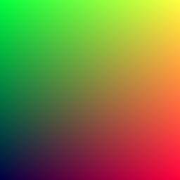

My interest in programming has always been related to my interest in graphics.
The first substantial program I wrote was a 2D plotting program in [Terrapin Logo](https://el.media.mit.edu/logo-foundation/resources/logoupdate/v8n2/terrapin.html), followed quickly by a deep dive into the world of C++ and OpenGL.
While in undergrad, I was sure to take a 3D graphics course, where we built a ray tracer by following [Peter Shirley's Fundamentals of Computer Graphics](http://www.cs.cornell.edu/~srm/fcg3/).
Recently I discovered [Peter Shirley's Ray Tracing in One Weekend](https://raytracing.github.io/books/RayTracingInOneWeekend.html), and figured I would take the opportunity to learn more about Rust and create a few short write-ups for motivation.

### Introduction

In general, I will avoid covering too much theory since it is covered better by Shirley, I recommend reading along in the source material, but as a quick introduction I will summarize ray tracing.
Ray tracing is the process of simulating (in a very rudimentary way) the physics of light reflecting off objects to produce a 2D image.
As such ray tracing is generally very good at simulating more complex lighting effects like shadows, reflections, highlights on shiny materials, diffraction, diffusion, and other effects resulting from light passing through transparent materials.
The downside of ray tracing is that it is generally quite slow, with more complex features requiring longer simulation times.
This is in contrast to "raster" graphics pipelines which apply matrix operations to points in space to map a 3D scene to a 2D image, this is very fast, but does not handle lighting effects well.
In recent years the lines between these two approaches have become progressively more blurred with the advent of programmable graphics pipelines (shaders), and other techniques to better simulate lighting in raster pipelines.

With that out of the way, let's get started with [Chapter 2: Output an Image](https://raytracing.github.io/books/RayTracingInOneWeekend.html#outputanimage).

### Project Setup

The first thing to do is create an empty Rust project using `cargo`.

```shell{outputLines: 2, 6-10}
cargo new ray-tracing-in-one-weekend-with-rust
     Created binary (application) `ray-tracing-in-one-weekend-with-rust` package
cd ray-tracing-in-one-weekend-with-rust/
git add .
git commit -m 'Add project generated with cargo new'
[master (root-commit) 049d97d] Add project generated with cargo new
 3 files changed, 13 insertions(+)
 create mode 100644 .gitignore
 create mode 100644 Cargo.toml
 create mode 100644 src/main.rs
```

### The PPM Image Format

The chapter starts with a small example of generating a [PPM](https://en.wikipedia.org/wiki/Netpbm#PPM_example) image.
The PPM format is a very simple text based image format, it has a header with the width and height, followed by a line for each pixel's color.
This format is ideal since it is easy to generate and doesn't require any additional libraries, the downside being that it is unsupported by many image viewers.
In the future I will likely look into generating a more user-friendly image format.
Translating the C++ program into Rust results in:

```rust{numberLines: true}
fn main() {
    const IMAGE_WIDTH: u32 = 256;
    const IMAGE_HEIGHT: u32 = 256;

    print!("P3\n{} {}\n255\n", IMAGE_WIDTH, IMAGE_WIDTH);

    for j in (0..IMAGE_HEIGHT).rev() {
        for i in 0..IMAGE_WIDTH {
            let r: f64 = (i as f64) / (IMAGE_WIDTH - 1) as f64;
            let g: f64 = (j as f64) / (IMAGE_HEIGHT - 1) as f64;
            let b: f64 = 0.25;

            let ir: u32 = (255.999 * r) as u32;
            let ig: u32 = (255.999 * g) as u32;
            let ib: u32 = (255.999 * b) as u32;

            print!("{} {} {}\n", ir, ig, ib);
        }
    }
}
```

### Creating an Image File

Using `cargo run` we can generate the image by redirecting `stdout` to `image.ppm`, the well-known image toolkit [ImageMagick](https://imagemagick.org/index.php) can be used to display the result.

```shell{outputLines: 2-3,5}
cargo run > image.ppm
    Finished dev [unoptimized + debuginfo] target(s) in 0.01s
     Running `target/debug/ray-tracing-in-one-weekend-with-rust`
file image.ppm 
image.ppm: Netpbm image data, size = 256 x 256, pixmap, ASCII text
display image.ppm
```

ImageMagick can also be used to convert the image into a more standard image format like PNG.

```shell{outputLines: 3}
convert image.ppm image.png
file image.png 
image.png: PNG image data, 256 x 256, 8-bit/color RGB, non-interlaced
```



### Adding a Progress Indicator

Finally, the chapter wraps up with a small addition, a simple progress indicator for each y-coordinate written to `stderr`.

```rust{numberLines: true}
fn main() {
    const IMAGE_WIDTH: u32 = 256;
    const IMAGE_HEIGHT: u32 = 256;

    print!("P3\n{} {}\n255\n", IMAGE_WIDTH, IMAGE_WIDTH);

    for j in (0..IMAGE_HEIGHT).rev() {
        eprint!("\rScanlines remaining: {} ", j); // highlight-line
        for i in 0..IMAGE_WIDTH {
            let r: f64 = (i as f64) / (IMAGE_WIDTH - 1) as f64;
            let g: f64 = (j as f64) / (IMAGE_HEIGHT - 1) as f64;
            let b: f64 = 0.25;

            let ir: u32 = (255.999 * r) as u32;
            let ig: u32 = (255.999 * g) as u32;
            let ib: u32 = (255.999 * b) as u32;

            print!("{} {} {}\n", ir, ig, ib);
        }
    }

    eprint!("\nDone.\n"); // highlight-line
} 
```

The complete code is [available here](https://github.com/austindoupnik/ray-tracing-in-one-weekend-with-rust/tree/v0.0.1-chapter.2).
