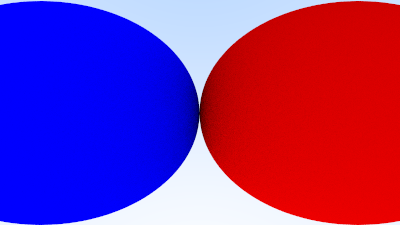
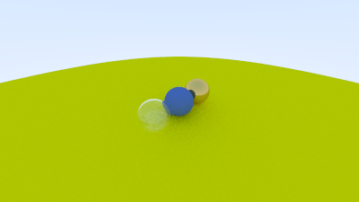
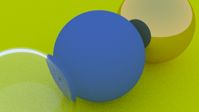

The next chapter is very quick.
We explore improving our camera to make it a bit easier to configure.

First we add a field-of-view:

```rust{numberLines: true}
impl Camera {
    pub fn new(fov: f64, aspect_ratio: f64, focal_length: f64) -> Camera { // highlight-line
        let theta = f64::to_radians(fov); // highlight-line
        let h = f64::tan(theta / 2.0); // highlight-line
        let viewport_height = 2.0 * h; // highlight-line
        let viewport_width = aspect_ratio * viewport_height;

        let origin =  Point3::new(0.0, 0.0, 0.0);
        let horizontal = Vec3::new(viewport_width, 0.0, 0.0);
        let vertical = Vec3::new(0.0, viewport_height, 0.0);
        Camera {
            origin,
            horizontal,
            vertical,
            lower_left_corner: origin - horizontal / 2.0 - vertical / 2.0 - Vec3::new(0.0, 0.0, focal_length),
        }
    }

    pub fn get_ray(&self, u: f64, v: f64) -> Ray {
        Ray::new(self.origin, self.lower_left_corner + u * self.horizontal + v * self.vertical - self.origin)
    }
}
```

Update `main`:

```rust{numberLines: true} 
    let max_depth = 50;

    let r = f64::cos(f64::consts::PI / 4.0); // highlight-line

    let material_left = Rc::new(Lambertian::new(Color::new(0.0, 0.0, 1.0))); // highlight-line
    let material_right = Rc::new(Lambertian::new(Color::new(1.0, 0.0, 0.0))); // highlight-line

    let mut world = HittableList::new();
    world.add(Rc::new(Sphere::new(Point3::new(-r, 0.0, -1.0), r, material_left.clone()))); // highlight-line
    world.add(Rc::new(Sphere::new(Point3::new(r, 0.0, -1.0), r, material_right.clone()))); // highlight-line
    let world = world;

    let cam = Camera::new(90.0, aspect_ratio, 1.0); // highlight-line

    print!("P3\n{} {}\n255\n", image_width, image_height);
```

The result:



Next we add a few new parameters to configure the position and the direction of the camera:

```rust{numberLines: true}
impl Camera {
    pub fn new(lookfrom: Point3, lookat: Point3, vup: Vec3, fov: f64, aspect_ratio: f64) -> Camera { // highlight-line
        let theta = f64::to_radians(fov);
        let h = f64::tan(theta / 2.0);
        let viewport_height = 2.0 * h;
        let viewport_width = aspect_ratio * viewport_height;

        let w = Vec3::unit_vector(lookfrom - lookat); // highlight-line
        let u = Vec3::unit_vector(Vec3::cross(&vup, &w)); // highlight-line
        let v = Vec3::cross(&w, &u); // highlight-line

        let origin = lookfrom; // highlight-line
        let horizontal = viewport_width * u; // highlight-line
        let vertical = viewport_height * v; // highlight-line
        let lower_left_corner = origin - horizontal / 2.0 - vertical / 2.0 - w; // highlight-line

        Camera {
            origin,
            horizontal,
            vertical,
            lower_left_corner,
        }
    }

    pub fn get_ray(&self, u: f64, v: f64) -> Ray {
        Ray::new(self.origin, self.lower_left_corner + u * self.horizontal + v * self.vertical - self.origin)
    }
}
```

Update `main` with a `90.0` field-of-view:

```rust{numberLines:true}
    let max_depth = 50;

    let material_ground = Rc::new(Lambertian::new(Color::new(0.8, 0.8, 0.0)));
    let material_center = Rc::new(Lambertian::new(Color::new(0.1, 0.2, 0.5)));
    let material_left = Rc::new(Dielectric::new(1.5));
    let material_right = Rc::new(Metal::new(Color::new(0.8, 0.6, 0.2), 0.0));

    let mut world = HittableList::new();
    world.add(Rc::new(Sphere::new(Point3::new(0.0, -100.5, -1.0), 100.0, material_ground.clone())));
    world.add(Rc::new(Sphere::new(Point3::new(0.0, 0.0, -1.0), 0.5, material_center.clone())));
    world.add(Rc::new(Sphere::new(Point3::new(-1.0, 0.0, -1.0), 0.5, material_left.clone())));
    world.add(Rc::new(Sphere::new(Point3::new(-1.0, 0.0, -1.0), -0.45, material_left.clone())));
    world.add(Rc::new(Sphere::new(Point3::new(1.0, 0.0, -1.0), 0.5, material_right.clone())));
    let world = world;

    let cam = Camera::new(Point3::new(-2.0, 2.0, 1.0), Point3::new(0.0, 0.0, -1.0), Vec3::new(0.0, 1.0, 0.0), 90.0, aspect_ratio); // highlight-line

    print!("P3\n{} {}\n255\n", image_width, image_height);
```

The result:



Update `main` with a `20.0` field-of-view:

```rust{numberLines: true}
    let world = world;

    let cam = Camera::new(Point3::new(-2.0, 2.0, 1.0), Point3::new(0.0, 0.0, -1.0), Vec3::new(0.0, 1.0, 0.0), 20.0, aspect_ratio); // highlight-line

    print!("P3\n{} {}\n255\n", image_width, image_height);
```

The result:



The complete code is [available here](https://github.com/austindoupnik/ray-tracing-in-one-weekend-with-rust/tree/v0.0.1-chapter.11).