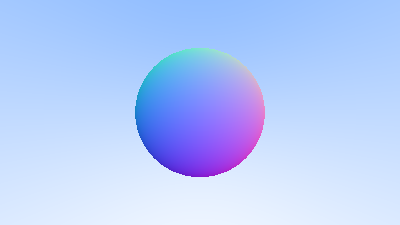
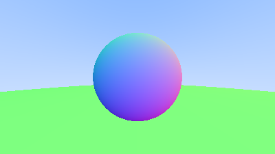

Before we get started with [Surface Normals and Multiple Objects](https://raytracing.github.io/books/RayTracingInOneWeekend.html#surfacenormalsandmultipleobjects), I want to cover a few Rust style improvements.

First, I added a [constructor](https://doc.rust-lang.org/1.0.0/style/ownership/constructors.html) for the `Vec3` type:

```rust{numberLines: true}
impl Vec3 {
    pub fn new(x: f64, y: f64, z: f64) -> Vec3 { // highlight-line
        Vec3 { // highlight-line
            e: [x, y, z], // highlight-line
        } // highlight-line
    }

    pub fn x(&self) -> f64 {
        self.e[0]
    }

```

Second, I removed some unneeded explicit types on `let` assignments:

```rust{numberLines: true}
    let origin = Point3::new(0.0, 0.0, 0.0); // highlight-line
    let horizontal  = Vec3::new(VIEWPORT_WIDTH, 0.0, 0.0); // highlight-line
    let vertical = Vec3::new(0.0, VIEWPORT_HEIGHT, 0.0); // highlight-line

    let lower_left_corner = origin - horizontal / 2.0 - vertical / 2.0 - Vec3::new(0.0, 0.0, FOCAL_LENGTH ); // highlight-line
```

Finally, I removed an unneeded `return` statement:

```rust{numberLines: true}
fn hit_sphere(center: &Point3, radius: f64, r: &Ray) -> bool {
    let oc = r.origin() - *center;
    let a = dot(r.direction(), r.direction());
    let b = 2.0 * dot(oc, r.direction());
    let c = dot(oc, oc) - radius * radius;
    let discriminant = b * b - 4.0 * a * c;
    discriminant > 0.0 // highlight-line
}
```

### Shading with Surface Normals

In the previous post we were able to determine `if` our ray intersected with a sphere.
Now we need to determine the surface normal at the point of intersection, which we can then use to shade the sphere.
We have not yet introduced any lighting, so we will start with a simple visualization of the normals.

First, we update our `hit_sphere` function to return the `t` at which the ray intersects the sphere, instead of a `bool`:

```rust{numberLines: true}
fn hit_sphere(center: &Point3, radius: f64, r: &Ray) -> f64 { // highlight-line
    let oc = r.origin() - *center;
    let a = dot(r.direction(), r.direction());
    let b = 2.0 * dot(oc, r.direction());
    let c = dot(oc, oc) - radius * radius;
    let discriminant = b * b - 4.0 * a * c;
    if discriminant < 0.0 { // highlight-line
        -1.0 // highlight-line
    } else { // highlight-line
        (-b - f64::sqrt(discriminant)) / (2.0 * a) // highlight-line
    } // highlight-line
}
```

Next, we update our `ray_color` function to derive the surface color from the surface normal:

```rust{numberLines: true}
fn ray_color(r: &Ray) -> Color {
    let t = hit_sphere(&Point3::new(0.0, 0.0, -1.0), 0.5, r); // highlight-line
    if t > 0.0 { // highlight-line
        let n = unit_vector(r.at(t) - Vec3::new(0.0, 0.0, -1.0)); // highlight-line
        0.5 * Color::new(n.x() + 1.0, n.y() + 1.0, n.z() + 1.0) // highlight-line
    } else { // highlight-line
        let unit_direction = unit_vector(r.direction());
        let t = 0.5 * (unit_direction.y() + 1.0);
        (1.0 - t) * Color::new(1.0, 1.0, 1.0) + t * Color::new(0.5, 0.7, 1.0)
    } // highlight-line
}
```

This results in a nice color gradient on our sphere:



### Simplifying the Ray-Sphere Intersection Code

The first observation is that $$v \cdot v = \| v \|^2$$, allowing us to change:

```rust{numberLines: true}
fn hit_sphere(center: &Point3, radius: f64, r: &Ray) -> f64 {
    let oc = r.origin() - *center;
    let a = r.direction().length_squared(); // highlight-line
    let b = 2.0 * dot(oc, r.direction());
    let c = oc.length_squared() - radius * radius; // highlight-line
    let discriminant = b * b - 4.0 * a * c;
    if discriminant < 0.0 {
        -1.0
    } else {
        (-b - f64::sqrt(discriminant)) / (2.0 * a)
    }
}
```

I don't entirely agree that this is a meaningful or useful simplification, but let's go with it.

Next, we can revisit our [quadratic formula](https://en.wikipedia.org/wiki/Quadratic_formula), but considering $$b = 2h$$:

$$
\begin{aligned}
t &= \frac{-b \pm \sqrt{b^2 - 4ac}}{2a} \\
t &= \frac{-2h \pm \sqrt{(2h)^2 - 4ac}}{2a} \\
t &= \frac{-2h \pm 2\sqrt{h^2 - ac}}{2a} \\
t &= \frac{-h \pm \sqrt{h^2 - ac}}{a} \\
\end{aligned}
$$

This is a pretty neat rearrangement since for us `b = 2.0 * dot(oc, r.direction())` meaning that `h = dot(oc, r.direction())`.
Let's update the `hit_sphere` function:

```rust{numberLines: true}
fn hit_sphere(center: &Point3, radius: f64, r: &Ray) -> f64 {
    let oc = r.origin() - *center;
    let a = r.direction().length_squared();
    let half_b = dot(oc, r.direction()); // highlight-line
    let c = oc.length_squared() - radius * radius;
    let discriminant = half_b * half_b - a * c; // highlight-line
    if discriminant < 0.0 {
        -1.0
    } else {
        (-half_b - f64::sqrt(discriminant)) / a // highlight-line
    }
}
```

### An Abstraction for Hittable Objects

In this section we will introduce the concept of a `hittable` object, this will allow us to add multiple objects to the scene, and in the future different types of objects.
This is where I will begin to encounter Rust concepts that are newer to me, and will be learning as I go the best way to handle each situation.
Again I will mention that some style choices in the source material (naming, member visibility, etc) are different from my personal style, but I am attempting to keep the code somewhat similar for now.

We first introduce a new `struct` called `HitRecord` which will store the results of a ray intersecting with a `Hittable` object:

```rust{numberLines: true}
pub struct HitRecord {
    pub p: Point3,
    pub normal: Vec3,
    pub t: f64,
}

impl HitRecord {
    pub fn new() -> HitRecord {
        HitRecord {
            p: Point3::new(f64::NEG_INFINITY, f64::NEG_INFINITY, f64::NEG_INFINITY),
            normal: Vec3::new(f64::NEG_INFINITY, f64::NEG_INFINITY, f64::NEG_INFINITY),
            t: f64::NEG_INFINITY,
        }
    }
}
```

_Note_: The `f64::NEG_INFINITY` used to initialize the `f64` don't really matter, they should never be accessed without being modified.
I set them to `f64::NEG_INFINITY` here so that if they are used without being changed the rendered image will likely have some noticeable artifacts to let me know something is wrong.
In a future post I will explore restructuring the code to avoid needing these values at all.

We then define a new trait called `Hittable`:

```rust{numberLines: true}
pub trait Hittable {
    fn hit(&self, r: &Ray, t_min: f64, t_max: f64, rec: &mut HitRecord) -> bool;
}
```

I think it is worth comparing this to the C++ equivalent real quick, as it captures a design decision of Rust I appreciate:

```cpp{numberLines: true}
class hittable {
    public:
        virtual bool hit(const ray& r, double t_min, double t_max, hit_record& rec) const = 0;
};
```

Specifically Rust prefers immutability by default, with mutability needing to be specified when necessary.
On the other hand C++ prefers mutability by default, with immutability needing to be specified.
In practice this leads to C++ code having a lot of extra noise in the form of `const` as well as being easy to forget accidentally.

Moving on, the next piece to define is a `Hittable` sphere:

```rust{numberLines: true}
pub struct Sphere {
    pub center: Point3,
    pub radius: f64,
}

impl Sphere {
    pub fn new(center: Point3, radius: f64) -> Sphere {
        Sphere {
            center,
            radius,
        }
    }
}

impl Hittable for Sphere {
    fn hit(&self, r: &Ray, t_min: f64, t_max: f64, rec: &mut HitRecord) -> bool {
        let oc = r.origin() - self.center;
        let a = r.direction().length_squared();
        let half_b = dot(oc, r.direction());
        let c = oc.length_squared() - self.radius * self.radius;
        let discriminant = half_b * half_b - a * c;

        if discriminant > 0.0 {
            let root = f64::sqrt(discriminant);

            let temp = (-half_b - root) / a;
            if temp < t_max && temp > t_min {
                rec.t = temp;
                rec.p = r.at(rec.t);
                rec.normal = (rec.p - self.center) / self.radius;
                return true;
            }

            let temp = (-half_b + root) / a;
            if temp < t_max && temp > t_min {
                rec.t = temp;
                rec.p = r.at(rec.t);
                rec.normal = (rec.p - self.center) / self.radius;
                return true;
            }
        }

        return false;
    }
}
```

At this point I will take a minor deviation from the source material and refactor our existing hit code to use what we just created:

```rust{numberLines: true}
fn ray_color(r: &Ray) -> Color {
    let mut rec = HitRecord::new(); // highlight-line
    let sphere = Sphere::new(Point3::new(0.0, 0.0, -1.0), 0.5); // highlight-line
    if sphere.hit(r, f64::NEG_INFINITY, f64::INFINITY, &mut rec) { // highlight-line
        let n = rec.normal; // highlight-line
        0.5 * Color::new(n.x() + 1.0, n.y() + 1.0, n.z() + 1.0)
    } else {
        let unit_direction = unit_vector(r.direction());
        let t = 0.5 * (unit_direction.y() + 1.0);
        (1.0 - t) * Color::new(1.0, 1.0, 1.0) + t * Color::new(0.5, 0.7, 1.0)
    }
}
```


### Front Faces Versus Back Faces

Eventually we will need to know which side of a surface the normal is hitting.
Luckily this can be determined pretty easily by taking the dot product of the ray direction and the surface normal:

```rust{numberLines: true}
pub struct HitRecord {
    pub p: Point3,
    pub normal: Vec3,
    pub t: f64,
    pub front_face: bool, // highlight-line
}

impl HitRecord {
    pub fn new() -> HitRecord {
        HitRecord {
            p: Point3::new(f64::NEG_INFINITY, f64::NEG_INFINITY, f64::NEG_INFINITY),
            normal: Vec3::new(f64::NEG_INFINITY, f64::NEG_INFINITY, f64::NEG_INFINITY),
            t: f64::NEG_INFINITY,
            front_face: false, // highlight-line
        }
    }

    pub fn set_face_normal(&mut self, r: &Ray, outward_normal: &Vec3) { // highlight-line
        self.front_face = dot(r.direction(), *outward_normal) < 0.0; // highlight-line
        self.normal = if self.front_face { // highlight-line
            *outward_normal // highlight-line
        } else { // highlight-line
            -*outward_normal // highlight-line
        } // highlight-line
    } // highlight-line
}
```

_Note_: It is debatable if `outward_normal` should be a reference or not, in a future post I would like to benchmark and see.

The sphere `hit` function:

```rust{numberLines: true}
impl Hittable for Sphere {
    fn hit(&self, r: &Ray, t_min: f64, t_max: f64, rec: &mut HitRecord) -> bool {
        let oc = r.origin() - self.center;
        let a = r.direction().length_squared();
        let half_b = dot(oc, r.direction());
        let c = oc.length_squared() - self.radius * self.radius;
        let discriminant = half_b * half_b - a * c;

        if discriminant > 0.0 {
            let root = f64::sqrt(discriminant);

            let temp = (-half_b - root) / a;
            if temp < t_max && temp > t_min {
                rec.t = temp;
                rec.p = r.at(rec.t);
                let outward_normal = (rec.p - self.center) / self.radius; // highlight-line
                rec.set_face_normal(r, &outward_normal); // highlight-line
                return true;
            }

            let temp = (-half_b + root) / a;
            if temp < t_max && temp > t_min {
                rec.t = temp;
                rec.p = r.at(rec.t);
                let outward_normal = (rec.p - self.center) / self.radius; // highlight-line
                rec.set_face_normal(r, &outward_normal); // highlight-line
                return true;
            }
        }

        return false;
    }
}
```

### A List of Hittable Objects

In addition to our `Sphere` we will define one more `Hittable` which contains a list of `Hittable` allowing multiple objects in the scene:

```rust{numberLines: true}
pub struct HittableList {
    pub objects: Vec<Rc<dyn Hittable>>,
}

impl HittableList {
    pub fn new() -> HittableList {
        HittableList {
            objects: vec![],
        }
    }

    pub fn add(&mut self, object: Rc<dyn Hittable>) {
        self.objects.push(object)
    }
}

impl Hittable for HittableList {
    fn hit(&self, r: &Ray, t_min: f64, t_max: f64, rec: &mut HitRecord) -> bool {
        let mut hit_anything = false;
        let mut closest_so_far = t_max;
        for object in self.objects.as_slice() {
            let mut temp_rec = HitRecord::new();
            if object.hit(r, t_min, closest_so_far, &mut temp_rec) {
                hit_anything = true;
                closest_so_far = temp_rec.t;
                *rec = temp_rec;
            }
        }

        hit_anything
    }
}
```

### Some New C++ Features

While obviously not about C++, this is a good section to talk a bit about Rust references.
Rust has a very strict definition of reference ownership and reference lifetimes.
This is a great thing, as the implicit lifetimes and ownership model in other languages can lead to some pretty nasty bugs.

In this case we will see that the source material often made the design decision to allow references to be owned by multiple owners. 
This is made fairly clear by the use of `shared_ptr` which is a reference counted pointer.
The equivalent in Rust is the [`Rc`](https://doc.rust-lang.org/std/rc/struct.Rc.html) struct, and you will see it used quite a bit.
In future posts I will explore other ownership models for references to see how they affect the code, but these changes might result in some large deviations from the source material, and will be left for a later time.

### Common Constants and Utility Functions

The constants and utility functions defined in this section already exist in Rust, but we do need to update our main function:

```rust{numberLines: true}
fn ray_color(r: &Ray, world: &dyn Hittable) -> Color { // highlight-line
    let mut rec = HitRecord::new();
    if world.hit(r, 0.0, f64::INFINITY, &mut rec) { // highlight-line
        0.5 * (rec.normal + Color::new(1.0, 1.0, 1.0)) // highlight-line
    } else {
        let unit_direction = unit_vector(r.direction());
        let t = 0.5 * (unit_direction.y() + 1.0);
        (1.0 - t) * Color::new(1.0, 1.0, 1.0) + t * Color::new(0.5, 0.7, 1.0)
    }
}

fn main() {
    const ASPECT_RATIO: f64 = 16.0 / 9.0;

    const IMAGE_WIDTH: u32 = 400;
    const IMAGE_HEIGHT: u32 = (IMAGE_WIDTH as f64 / ASPECT_RATIO) as u32;

    let mut world = HittableList::new(); // highlight-line
    world.add(Rc::new(Sphere::new(Point3::new(0.0, 0.0, -1.0), 0.5))); // highlight-line
    world.add(Rc::new(Sphere::new(Point3::new(0.0, -100.5, -1.0), 100.0))); // highlight-line
    let world = world; // highlight-line

    const VIEWPORT_HEIGHT: f64 = 2.0;
    const VIEWPORT_WIDTH: f64 = ASPECT_RATIO * VIEWPORT_HEIGHT;
    const FOCAL_LENGTH: f64 = 1.0;

    let origin = Point3::new(0.0, 0.0, 0.0);
    let horizontal = Vec3::new(VIEWPORT_WIDTH, 0.0, 0.0);
    let vertical = Vec3::new(0.0, VIEWPORT_HEIGHT, 0.0);

    let lower_left_corner = origin - horizontal / 2.0 - vertical / 2.0 - Vec3::new(0.0, 0.0, FOCAL_LENGTH);

    print!("P3\n{} {}\n255\n", IMAGE_WIDTH, IMAGE_HEIGHT);

    for j in (0..IMAGE_HEIGHT).rev() {
        eprint!("\rScanlines remaining: {} ", j);
        for i in 0..IMAGE_WIDTH {
            let u = i as f64 / (IMAGE_WIDTH - 1) as f64;
            let v = j as f64 / (IMAGE_HEIGHT - 1) as f64;

            let r = ray::new(origin, lower_left_corner + u * horizontal + v * vertical - origin);
            let pixel_color = ray_color(&r, &world); // highlight-line
            write_color(io::stdout().borrow_mut(), pixel_color).unwrap();
        }
    }

    eprint!("\nDone.\n");
}
```

This results in an image with our original sphere and a green "ground" sphere:



The complete code is [available here](https://github.com/austindoupnik/ray-tracing-in-one-weekend-with-rust/tree/v0.0.1-chapter.6).