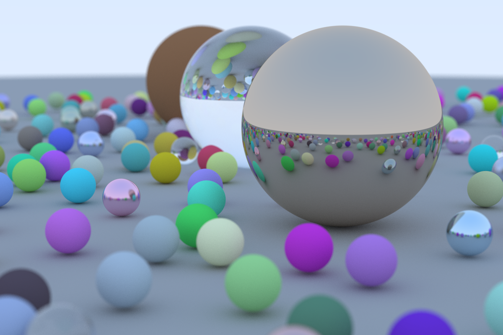

### A Final Render

Let's generate a version (using a different random number generator) of the source material's cover image.

First we generate the scene:

```rust{numberLines: true}
fn random_scene() -> HittableList {
    let mut world = HittableList::new();

    let ground_material = Lambertian::new(Color::new(0.5, 0.5, 0.5));
    world.add(Rc::new(Sphere::new(Point3::new(0.0, -1000.0, 0.0), 1000.0, Rc::new(ground_material))));

    for a in -11..11 {
        for b in -11..11 {
            let choose_mat = random();
            let center = Point3::new(a as f64 + 0.9 * random(), 0.2, b as f64 + 0.9 * random());

            if (center - Point3::new(4.0, 0.2, 0.0)).length() > 0.9 {
                let sphere_material: Rc<dyn Material> = if choose_mat < 0.8 {
                    let albedo = Color::random();
                    Rc::new(Lambertian::new(albedo))
                } else if choose_mat < 0.95 {
                    let albedo = Color::random_in_range(0.5, 1.0);
                    let fuzz = random_in_range(0.0, 0.5);
                    Rc::new(Metal::new(albedo, fuzz))
                } else {
                    Rc::new(Dielectric::new(1.5))
                };
                world.add(Rc::new(Sphere::new(center, 0.2, sphere_material.clone())));
            }
        }
    }

    let material1 = Dielectric::new(1.5);
    world.add(Rc::new(Sphere::new(Point3::new(0.0, 1.0, 0.0), 1.0, Rc::new(material1))));

    let material2 = Lambertian::new(Color::new(0.4, 0.2, 0.1));
    world.add(Rc::new(Sphere::new(Point3::new(-4.0, 1.0, 0.0), 1.0, Rc::new(material2))));

    let material3 = Metal::new(Color::new(0.7, 0.6, 0.5), 0.0);
    world.add(Rc::new(Sphere::new(Point3::new(4.0, 1.0, 0.0), 1.0, Rc::new(material3))));

    world
}
```

Update `main`:

```rust{numberLines: true}
fn main() {
    let aspect_ratio = 3.0 / 2.0; // highlight-line

    let image_width = 1200; // highlight-line
    let image_height = (image_width as f64 / aspect_ratio) as u32;
    let samples_per_pixel = 500; // highlight-line
    let max_depth = 50;

    let world = random_scene(); // highlight-line

    let lookfrom = Point3::new(13.0, 2.0, 3.0); // highlight-line
    let lookat = Point3::new(0.0, 0.0, 0.0); // highlight-line
    let dist_to_focus = 10.0; // highlight-line

    let cam = Camera::new(lookfrom, lookat, Vec3::new(0.0, 1.0, 0.0), 20.0, aspect_ratio, 0.1, dist_to_focus); // highlight-line

    print!("P3\n{} {}\n255\n", image_width, image_height);
```

Since we have increased the number of `samples_per_pixel`, the `image_width`, and the complexity of the scene we will see a significant increase in the render time:

```shell{outputLines: 2-10}
time cargo run --release | convert - final-render.png
   Compiling ray-tracing-in-one-weekend-with-rust v0.1.0 (/home/austind/Documents/github.com/austindoupnik/ray-tracing-in-one-weekend-with-rust)
    Finished release [optimized] target(s) in 0.83s
     Running `target/release/ray-tracing-in-one-weekend-with-rust`
Scanlines remaining: 0   
Done.

real    93m37.776s
user    93m40.368s
sys     0m22.591s
```

As a comparison the machine I am using is not particularly powerful:

```shell{outputLines: 2-6}
head -5 /proc/cpuinfo 
processor       : 0
vendor_id       : GenuineIntel
cpu family      : 6
model           : 78
model name      : Intel(R) Core(TM) i5-6260U CPU @ 1.80GHz
```

This gives:



The complete code is [available here](https://github.com/austindoupnik/ray-tracing-in-one-weekend-with-rust/tree/v0.0.1-chapter.13).