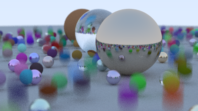

With the start of November I'll be moving on to the next book in the [Ray Tracing in One Weekend - The Book Series](https://raytracing.github.io/), [Ray Tracing The Next Week](https://raytracing.github.io/books/RayTracingTheNextWeek.html).

This book will cover a few more advanced techniques, so let's dig in with the second chapter, [Motion Blur](https://raytracing.github.io/books/RayTracingTheNextWeek.html#motionblur).

### Introduction of SpaceTime Ray Tracing

First let's update the `Ray` struct to store the time of the ray's creation:

```rust{numberLines: true}
pub struct Ray {
    pub origin: Point3,
    pub dir: Vec3,
    pub time: f64, // highlight-line
}

impl Ray {
    pub fn new(origin: Point3, dir: Vec3, time: f64) -> Ray { // highlight-line
        Ray {
            origin,
            dir,
            time, // highlight-line
        }
    }

    pub fn origin(&self) -> Point3 {
        self.origin
    }

    pub fn direction(&self) -> Vec3 {
        self.dir
    }

    pub fn at(&self, t: f64) -> Point3 {
        self.origin + t * self.dir
    }

    pub fn time(&self) -> f64 { // highlight-line
        self.time // highlight-line
    } // highlight-line
}
```

### Updating the Camera to Simulate Motion Blur

Next let's emulate the open and close of a camera shutter, by adding a start and end time to our `Camera` and
assigning each ray a random time between these two times:

```rust{numberLines: true}
pub struct Camera {
    pub origin: Point3,
    pub lower_left_corner: Point3,
    pub horizontal: Vec3,
    pub vertical: Vec3,
    pub lens_radius: f64,
    pub u: Vec3,
    pub v: Vec3,
    pub time0: f64, // highlight-line
    pub time1: f64, // highlight-line
}

impl Camera {
    pub fn new(
        lookfrom: Point3,
        lookat: Point3,
        vup: Vec3,
        fov: f64,
        aspect_ratio: f64,
        aperture: f64,
        focus_dist: f64,
        time0: f64, // highlight-line
        time1: f64, // highlight-line
    ) -> Camera {
        let theta = f64::to_radians(fov);
        let h = f64::tan(theta / 2.0);
        let viewport_height = 2.0 * h;
        let viewport_width = aspect_ratio * viewport_height;

        let w = Vec3::unit_vector(lookfrom - lookat);
        let u = Vec3::unit_vector(Vec3::cross(&vup, &w));
        let v = Vec3::cross(&w, &u);

        let origin = lookfrom;
        let horizontal = focus_dist * viewport_width * u;
        let vertical = focus_dist * viewport_height * v;
        let lower_left_corner = origin - horizontal / 2.0 - vertical / 2.0 - focus_dist * w;

        Camera {
            origin,
            horizontal,
            vertical,
            lower_left_corner,
            lens_radius: aperture / 2.0,
            u,
            v,
            time0, // highlight-line
            time1, // highlight-line
        }
    }

    pub fn get_ray(&self, s: f64, t: f64) -> Ray {
        let rd = self.lens_radius * Vec3::random_in_unit_disk();
        let offset = self.u * rd.x() + self.v * rd.y();

        Ray::new(
            self.origin + offset,
            self.lower_left_corner + s * self.horizontal + t * self.vertical - self.origin - offset,
            random_in_range(self.time0, self.time1) // highlight-line
        )
    }
}
```

### Adding Moving Spheres

Now we need to be able to add moving objects to the scene.
Let's add a sphere which is moving between two points, `center0` at time `time0` and `center1` at time `time1`, adding a method to determine the sphere position at a given time point with a linear interpolation between the two center points.

```rust{numberLines: true}
pub struct MovingSphere {
    pub center0: Point3,
    pub center1: Point3,
    pub time0: f64,
    pub time1: f64,
    pub radius: f64,
    pub mat_ptr: Rc<dyn Material>,
}

impl MovingSphere {
    pub fn new(center0: Point3, center1: Point3, time0: f64, time1: f64, radius: f64, mat_ptr: Rc<dyn Material>) -> Self {
        MovingSphere {
            center0,
            center1,
            time0,
            time1,
            radius,
            mat_ptr,
        }
    }

    pub fn center(&self, time: f64) -> Point3 {
        self.center0 + ((time - self.time0) / (self.time1 - self.time0)) * (self.center1 - self.center0)
    }
}
```

The `hit` function for a `MovingSphere` looks largely the same as the `hit` function for a `Sphere`.
The only difference is that we determine the center of the sphere based on the time of the ray's creation:

```rust{numberLines: true}
impl Hittable for MovingSphere {
    fn hit(&self, r: &Ray, t_min: f64, t_max: f64, rec: &mut HitRecord) -> bool {
        let oc = r.origin() - self.center(r.time()); // highlight-line
        let a = r.direction().length_squared();
        let half_b = Vec3::dot(&oc, &r.direction());
        let c = oc.length_squared() - self.radius * self.radius;
        let discriminant = half_b * half_b - a * c;

        if discriminant > 0.0 {
            let root = f64::sqrt(discriminant);

            let temp = (-half_b - root) / a;
            if temp < t_max && temp > t_min {
                rec.t = temp;
                rec.p = r.at(rec.t);
                let outward_normal = (rec.p - self.center(r.time())) / self.radius; // highlight-line
                rec.set_face_normal(r, &outward_normal);
                rec.mat_ptr = Some(self.mat_ptr.clone());
                return true;
            }

            let temp = (-half_b + root) / a;
            if temp < t_max && temp > t_min {
                rec.t = temp;
                rec.p = r.at(rec.t);
                let outward_normal = (rec.p - self.center(r.time())) / self.radius; // highlight-line
                rec.set_face_normal(r, &outward_normal);
                rec.mat_ptr = Some(self.mat_ptr.clone());
                return true;
            }
        }

        return false;
    }
}
```

### Tracking the Time of Ray Intersection

Let's make a few small changes to our `Material`s to track the time of the ray.
First our `Lambertian`:

```rust{numberLines: true}
impl Material for Lambertian {
    fn scatter(&self, r_in: &Ray, rec: &HitRecord, attenuation: &mut Color, scattered: &mut Ray) -> bool {
        let scatter_direction = rec.normal + Vec3::random_unit_vector();
        *scattered = Ray::new(rec.p, scatter_direction, r_in.time()); // highlight-line
        *attenuation = self.albedo;

        true
    }
}
```

Then our `Metal`:

```rust{numberLines: true}
impl Material for Metal {
    fn scatter(&self, r_in: &Ray, rec: &HitRecord, attenuation: &mut Color, scattered: &mut Ray) -> bool {
        let reflected = Vec3::reflect(&Vec3::unit_vector(r_in.direction()), &rec.normal);
        *scattered = Ray::new(rec.p, reflected + self.fuzz * Vec3::random_in_unit_sphere(), r_in.time()); // highlight-line
        *attenuation = self.albedo;

        Vec3::dot(&scattered.direction(), &rec.normal) > 0.0
    }
}
```

Finally, our `Dielectric`:

```rust{numberLines: true}
impl Material for Dielectric {
    fn scatter(&self, r_in: &Ray, rec: &HitRecord, attenuation: &mut Color, scattered: &mut Ray) -> bool {
        *attenuation = Color::new(1.0, 1.0, 1.0);
        let refraction_ratio = if rec.front_face {
            1.0 / self.ir
        } else {
            self.ir
        };

        let unit_direction = Vec3::unit_vector(r_in.direction());
        let cos_theta = f64::min(Vec3::dot(&-unit_direction, &rec.normal), 1.0);
        let sin_theta = f64::sqrt(1.0 - cos_theta * cos_theta);

        let direction = if refraction_ratio * sin_theta > 1.0 || Dielectric::reflectance(cos_theta, refraction_ratio) > random() {
            Vec3::reflect(&unit_direction, &rec.normal)
        } else {
            Vec3::refract(&unit_direction, &rec.normal, refraction_ratio)
        };

        *scattered = Ray::new(rec.p, direction, r_in.time()); // highlight-line

        true
    }
}
```

### Putting Everything Together

Let's add some `MovingSphere`s to our scene:

```rust{numberLines: true}
fn random_scene() -> HittableList {
    let mut world = HittableList::new();

    let ground_material = Lambertian::new(Color::new(0.5, 0.5, 0.5));
    world.add(Rc::new(Sphere::new(Point3::new(0.0, -1000.0, 0.0), 1000.0, Rc::new(ground_material))));

    for a in -11..11 {
        for b in -11..11 {
            let choose_mat = random();
            let center = Point3::new(a as f64 + 0.9 * random(), 0.2, b as f64 + 0.9 * random());

            if (center - Point3::new(4.0, 0.2, 0.0)).length() > 0.9 {
                if choose_mat < 0.8 { // highlight-line
                    let albedo = Color::random() * Color::random();
                    let sphere_material = Rc::new(Lambertian::new(albedo));
                    let center1 = center + Vec3::new(0.0, random_in_range(0.0, 0.5), 0.0); // highlight-line 
                    world.add(Rc::new(MovingSphere::new(center, center1, 0.0, 1.0, 0.2, sphere_material.clone()))); // highlight-line
                } else if choose_mat < 0.95 {
                    let albedo = Color::random_in_range(0.5, 1.0);
                    let fuzz = random_in_range(0.0, 0.5);
                    let sphere_material = Rc::new(Metal::new(albedo, fuzz)); // highlight-line
                    world.add(Rc::new(Sphere::new(center, 0.2, sphere_material.clone()))); // highlight-line
                } else {
                    let sphere_material = Rc::new(Dielectric::new(1.5)) // highlight-line;
                    world.add(Rc::new(Sphere::new(center, 0.2, sphere_material.clone()))) // highlight-line;
                }
            }
        }
    }

    let material1 = Dielectric::new(1.5);
    world.add(Rc::new(Sphere::new(Point3::new(0.0, 1.0, 0.0), 1.0, Rc::new(material1))));

    let material2 = Lambertian::new(Color::new(0.4, 0.2, 0.1));
    world.add(Rc::new(Sphere::new(Point3::new(-4.0, 1.0, 0.0), 1.0, Rc::new(material2))));

    let material3 = Metal::new(Color::new(0.7, 0.6, 0.5), 0.0);
    world.add(Rc::new(Sphere::new(Point3::new(4.0, 1.0, 0.0), 1.0, Rc::new(material3))));

    world
}
```

Update our camera parameters:

```rust{numberLines:true}
fn main() {
    let aspect_ratio = 16.0 / 9.0; // highlight-line

    let image_width = 400; // highlight-line
    let image_height = (image_width as f64 / aspect_ratio) as u32;
    let samples_per_pixel = 100; // highlight-line
    let max_depth = 50; // highlight-line

    let world = random_scene();

    let lookfrom = Point3::new(13.0, 2.0, 3.0);
    let lookat = Point3::new(0.0, 0.0, 0.0);
    let dist_to_focus = 10.0;

    let cam = Camera::new(lookfrom, lookat, Vec3::new(0.0, 1.0, 0.0), 20.0, aspect_ratio, 0.1, dist_to_focus, 0.0, 1.0); // highlight-line

    print!("P3\n{} {}\n255\n", image_width, image_height);
```

The result:



The complete code is [available here](https://github.com/austindoupnik/ray-tracing-in-one-weekend-with-rust/tree/v0.0.1-the-next-week-chapter.2).