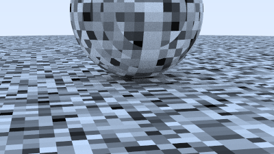
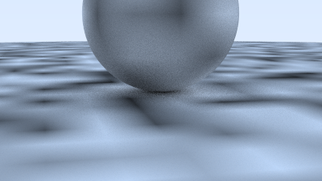
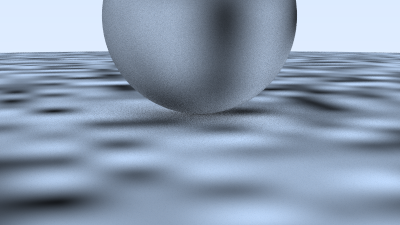
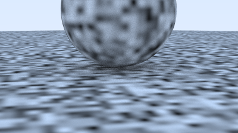
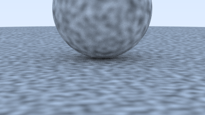
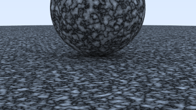
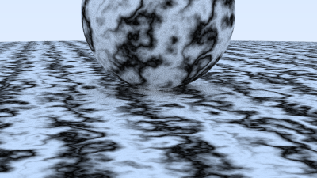

Perlin noise is an extremely common technique in any sort of procedural generation process.
As we will see perlin noise allows us to generate smooth and repeatable random data with well understood parameters.

First we create a small `struct` to calculate our perlin noise function:

```rust{numberLines: true}
const POINT_COUNT: usize = 256;

pub struct Perlin {
    ranfloat: [f64; POINT_COUNT],

    perm_x: [i32; POINT_COUNT],
    perm_y: [i32; POINT_COUNT],
    perm_z: [i32; POINT_COUNT],
}

impl Perlin {
    pub fn new() -> Self {
        let mut ranfloat: [f64; 256] = [0.0; 256];
        for i in 0..ranfloat.len() {
            ranfloat[i] = random();
        }

        Perlin {
            ranfloat,

            perm_x: perlin_generate_perm(),
            perm_y: perlin_generate_perm(),
            perm_z: perlin_generate_perm(),
        }
    }

    pub fn noise(self: &Self, p: &Point3) -> f64 {
        let i = ((4.0 * p.x()) as i32 & 255) as usize;
        let j = ((4.0 * p.y()) as i32 & 255) as usize;
        let k = ((4.0 * p.z()) as i32 & 255) as usize;

        return self.ranfloat[(self.perm_x[i] ^ self.perm_y[j] ^ self.perm_z[k]) as usize];
    }
}

fn perlin_generate_perm() -> [i32; 256] {
    let mut p: [i32; 256] = [0; 256];
    for i in 0..p.len() {
        p[i] = i as i32;
    }

    permute(&mut p, POINT_COUNT);

    p
}

fn permute(p: &mut [i32; POINT_COUNT], n: usize) {
    for i in (1..n - 1).rev() {
        let target = random_usize_in_range(0, i);
        let tmp = p[i];
        p[i] = p[target];
        p[target] = tmp;
    }
}
```

Next we add a texture which derives a grey color from the noise:

```rust{numberLines: true}
pub struct NoiseTexture {
    noise: Perlin,
}

impl NoiseTexture {
    pub fn new() -> Self {
        NoiseTexture {
            noise: Perlin::new(),
        }
    }
}

impl Texture for NoiseTexture {
    fn value(self: &Self, _u: f64, _v: f64, p: &Point3) -> Color {
        Color::new(1.0, 1.0, 1.0) * self.noise.noise(p)
    }
}
```

Create a new scene using the noise texture:

```rust{numberLines: true}
fn two_perlin_spheres() -> HittableList {
    let pertext = Rc::new(NoiseTexture::new());

    let mut world = HittableList::new();
    world.add(Rc::new(Sphere::new(Point3::new(0.0, -1000.0, 0.0), 1000.0, Rc::new(Lambertian::new_from_texture(pertext.clone())))));
    world.add(Rc::new(Sphere::new(Point3::new(0.0,  2.0, 0.0), 2.0, Rc::new(Lambertian::new_from_texture(pertext.clone())))));

    world
}
```

Finally, add the scene to our `main` function:

```rust{numberLines: true}
    match 0 {
        1 => {
            world = random_scene();
            lookfrom = Point3::new(13.0, 2.0, 3.0);
            lookat = Point3::new(0.0, 0.0, 0.0);
            vfov = 20.0;
            aperture = 0.1;
        },
        2 => { // highlight-line
            world = two_spheres();
            lookfrom = Point3::new(13.0, 2.0, 3.0);
            lookat = Point3::new(0.0, 0.0, 0.0);
            vfov = 20.0;
            aperture = 0.0;
        },
        3 | _ => { // highlight-line
            world = two_perlin_spheres(); // highlight-line
            lookfrom = Point3::new(13.0, 2.0, 3.0); // highlight-line
            lookat = Point3::new(0.0, 0.0, 0.0); // highlight-line
            vfov = 20.0; // highlight-line
            aperture = 0.0; // highlight-line
        }, // highlight-line
    }
```

This results in:



### Smoothing out the Result

We can clearly see that we have produced a random pattern, but we can also clearly see that our pattern is extremely harsh.
To make our pattern look more organic we can apply a smoothing function:

```rust{numberLines: true}
    pub fn noise(self: &Self, p: &Point3) -> f64 {
        let u = p.x() - f64::floor(p.x());
        let v = p.y() - f64::floor(p.y());
        let w = p.z() - f64::floor(p.z());

        let i = f64::floor(p.x()) as i32; // highlight-line
        let j = f64::floor(p.y()) as i32; // highlight-line
        let k = f64::floor(p.z()) as i32; // highlight-line

        let mut c = [[[0.0; 2]; 2]; 2]; // highlight-line
        for di in 0..2 { // highlight-line
            for dj in 0..2 { // highlight-line
                for dk in 0..2 { // highlight-line
                    let i = ((i + di) & 255) as usize; // highlight-line
                    let j = ((j + dj) & 255) as usize; // highlight-line
                    let k = ((k + dk) & 255) as usize; // highlight-line

                    let hash = (self.perm_x[i] ^ self.perm_y[j] ^ self.perm_z[k]) as usize; // highlight-line

                    c[di as usize][dj as usize][dk as usize] = self.ranfloat[hash]; // highlight-line
                } // highlight-line
            } // highlight-line
        } // highlight-line

        trilinear_interp(c, u, v, w) // highlight-line
    }
}
```

The `trilinear_interp` function:

```rust{numberLines: true}
fn trilinear_interp(c: [[[f64; 2]; 2]; 2], u: f64, v: f64, w: f64) -> f64 {
    let mut accum = 0.0;
    for i in 0..2 {
        for j in 0..2 {
            for k in 0..2 {
                accum += 1.0
                    * (i as f64 * u + (1.0 - i as f64) * (1.0 - u))
                    * (j as f64 * v + (1.0 - j as f64) * (1.0 - v))
                    * (k as f64 * w + (1.0 - k as f64) * (1.0 - w))
                    * c[i][j][k];
            }
        }
    }
    accum
}
```

This will give us:



### Improvement with Hermitian Smoothing

We can remove the grid structure using a Hermite cubic:

```rust{numberLines: true}
    pub fn noise(self: &Self, p: &Point3) -> f64 {
        let u = p.x() - f64::floor(p.x());
        let u = u * u * (3.0 - 2.0 * u); // highlight-line

        let v = p.y() - f64::floor(p.y());
        let v = v * v * (3.0 - 2.0 * v); // highlight-line

        let w = p.z() - f64::floor(p.z());
        let w = w * w * (3.0 - 2.0 * w); // highlight-line
```

This gives:



### Tweaking the Frequency

We can scale up the input to our noise function to decrease the size of our features:

```rust{numberLines: true}
pub struct NoiseTexture {
    noise: Perlin,
    scale: f64, // highlight-line
}

impl NoiseTexture {
    pub fn new(scale: f64) -> Self { // highlight-line
        NoiseTexture {
            noise: Perlin::new(),
            scale, // highlight-line
        }
    }
}

impl Texture for NoiseTexture {
    fn value(self: &Self, _u: f64, _v: f64, p: &Point3) -> Color {
        let p = self.scale * p; // highlight-line
        Color::new(1.0, 1.0, 1.0) * self.noise.noise(&p) // highlight-line
    }
}
```

Resulting in:



### Using Random Vectors on the Lattice Points

This is still not as organic as we would like.
We will apply Ken Perlin's insight to leverage a grid of random vectors instead of individual scalar values:

```rust{numberLines: true}
pub struct Perlin {
    ranvec: [Vec3; POINT_COUNT], // highlight-line

    perm_x: [i32; POINT_COUNT],
    perm_y: [i32; POINT_COUNT],
    perm_z: [i32; POINT_COUNT],
}

impl Perlin {
    pub fn new() -> Self {
        let mut ranvec: [Vec3; 256] = [Vec3::new(0.0, 0.0, 0.0); 256]; // highlight-line
        for i in 0..ranvec.len() { // highlight-line
            ranvec[i] = Vec3::unit_vector(Vec3::random_in_range(-1.0, 1.0)); // highlight-line
        }

        Perlin {
            ranvec, // highlight-line

            perm_x: perlin_generate_perm(),
            perm_y: perlin_generate_perm(),
            perm_z: perlin_generate_perm(),
        }
    }

    pub fn noise(self: &Self, p: &Point3) -> f64 {
        let u = p.x() - f64::floor(p.x()); // highlight-line
        let v = p.y() - f64::floor(p.y()); // highlight-line
        let w = p.z() - f64::floor(p.z()); // highlight-line

        let i = f64::floor(p.x()) as i32;
        let j = f64::floor(p.y()) as i32;
        let k = f64::floor(p.z()) as i32;

        let mut c = [[[Vec3::new(0.0, 0.0, 0.0); 2]; 2]; 2]; // highlight-line
        for di in 0..2 {
            for dj in 0..2 {
                for dk in 0..2 {
                    let i = ((i + di) & 255) as usize;
                    let j = ((j + dj) & 255) as usize;
                    let k = ((k + dk) & 255) as usize;

                    let hash = (self.perm_x[i] ^ self.perm_y[j] ^ self.perm_z[k]) as usize;

                    c[di as usize][dj as usize][dk as usize] = self.ranvec[hash]; // highlight-line
                }
            }
        }

        perlin_interp(c, u, v, w) // highlight-line
    }
}

fn perlin_interp(c: [[[Vec3; 2]; 2]; 2], u: f64, v: f64, w: f64) -> f64 { // highlight-line
    let uu = u * u * (3.0 - 2.0 * u); // highlight-line
    let vv = v * v * (3.0 - 2.0 * v); // highlight-line
    let ww = w * w * (3.0 - 2.0 * w); // highlight-line

    let mut accum = 0.0;
    for i in 0..2 {
        for j in 0..2 {
            for k in 0..2 {
                let weight_v = Vec3::new(u - i as f64, v - j as f64, w - k as f64); // highlight-line
                accum += 1.0
                    * (i as f64 * uu + (1.0 - i as f64) * (1.0 - uu)) // highlight-line
                    * (j as f64 * vv + (1.0 - j as f64) * (1.0 - vv)) // highlight-line
                    * (k as f64 * ww + (1.0 - k as f64) * (1.0 - ww)) // highlight-line
                    * Vec3::dot(&c[i][j][k], &weight_v); // highlight-line
            }
        }
    }
    accum
}
```

The Perlin noise function can return a negative value, we will map the Perlin result into the range `(0, 1)`:

```rust{numberLines: true}
impl Texture for NoiseTexture {
    fn value(self: &Self, _u: f64, _v: f64, p: &Point3) -> Color {
        let p = self.scale * p; // highlight-line
        Color::new(1.0, 1.0, 1.0) * 0.5 * (1.0 + self.noise.noise(&p)) // highlight-line
    }
}
```

This gives us what we have been looking for:



### Introducing Turbulence

We can introduce a new parameter to our noise generation called "turbulence" by summing multiple noise functions of different frequencies:

```rust{numberLines: true}
    pub fn turb(self: &Self, p: &Point3, depth: Option<i32>) -> f64 {
        let depth = depth.unwrap_or(7);

        let mut accum = 0.0;
        let mut temp_p = *p;
        let mut weight = 1.0;

        for _ in 0..depth {
            accum += weight * self.noise(&temp_p);
            weight *= 0.5;
            temp_p *= 2.0;
        }

        f64::abs(accum)
    }
```

Updating our `NoiseTexture`:

```rust{numberLines: true}
impl Texture for NoiseTexture {
    fn value(self: &Self, _u: f64, _v: f64, p: &Point3) -> Color {
        let p = self.scale * p;
        Color::new(1.0, 1.0, 1.0) * self.noise.turb(&p, Option::None) // highlight-line
    }
}
```

The result:



### Adjusting the Phase

The final section introduces phase to generate a marble like texture:

```rust{numberLines: true}
impl Texture for NoiseTexture {
    fn value(self: &Self, _u: f64, _v: f64, p: &Point3) -> Color {
        Color::new(1.0, 1.0, 1.0) * 0.5 * (1.0 + f64::sin(self.scale * p.z() + 10.0 * self.noise.turb(p, Option::None))) // highlight-line
    }
}
```

Our result:



The complete code is [available here](https://github.com/austindoupnik/ray-tracing-in-one-weekend-with-rust/tree/v0.0.1-the-next-week-chapter.5).
