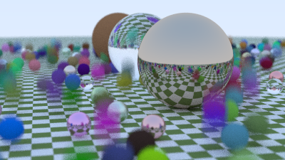
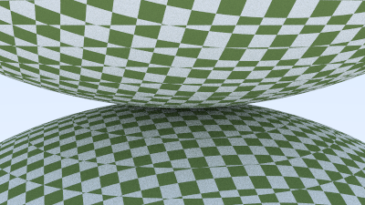

Next up, we will add textures to our surfaces.
In the most abstract sense a texture is a function which maps coordinates on a surface to a color for those coordinates.
The most commonly known use of textures is to map a 2D image onto a surface.
Let's get into it.

### The First Texture Class: Constant Texture

To begin we will simply map all coordinates to a single color.
First we create a new `Texture` trait, and `SolidColor` struct:

```rust{numberLines: true}
pub trait Texture {
    fn value(self: &Self, u: f64, v: f64, p: &Point3) -> Color;
}

pub struct SolidColor {
    color_value: Color,
}

impl SolidColor {
    pub fn new(color_value: Color) -> Self {
        SolidColor {
            color_value
        }
    }
}

impl Texture for SolidColor {
    fn value(self: &Self, _u: f64, _v: f64, _p: &Point3) -> Color {
        self.color_value
    }
}
```

Next we update our `HitRecord` to store the texture coordinates:

```rust{numberLines: true}
pub struct HitRecord {
    pub p: Point3,
    pub normal: Vec3,
    pub mat_ptr: Option<Rc<dyn Material>>,
    pub t: f64,
    pub u: f64, // highlight-line
    pub v: f64, // highlight-line
    pub front_face: bool,
}
```

### Texture Coordinates for Spheres

Please refer to the source section, [Texture Coordinates for Sphere](https://raytracing.github.io/books/RayTracingTheNextWeek.html#solidtextures/texturecoordinatesforspheres), for more details on how to derive the following equations.
The key point is that we derive a method to map 3D points on the surface of a sphere to 2D coordinates `(u, v)` in the range `[0, 1]`:

$$
\begin{aligned}
\phi &= atan2(z, -x) \\
\theta &= acos(-y) \\
\\
u &= \frac{\phi}{2\pi} \\
v &= \frac{\theta}{\pi} \\
\end{aligned}
$$

Translating this into rust we have:

```rust{numberLines: true}
fn get_sphere_uv(p: &Point3, u: &mut f64, v: &mut f64) { // highlight-line
    let theta = f64::cos(-p.y()); // highlight-line
    let phi = f64::atan2(-p.z(), p.x()) + std::f64::consts::PI // highlight-line;
    *u = phi / (2.0 * std::f64::consts::PI); // highlight-line
    *v = theta / std::f64::consts::PI; // highlight-line
} // highlight-line

impl Hittable for Sphere {
    fn hit(&self, r: &Ray, t_min: f64, t_max: f64, rec: &mut HitRecord) -> bool {
        let oc = r.origin() - self.center;
        let a = r.direction().length_squared();
        let half_b = Vec3::dot(&oc, &r.direction());
        let c = oc.length_squared() - self.radius * self.radius;
        let discriminant = half_b * half_b - a * c;

        if discriminant > 0.0 {
            let root = f64::sqrt(discriminant);

            let temp = (-half_b - root) / a;
            if temp < t_max && temp > t_min {
                rec.t = temp;
                rec.p = r.at(rec.t);
                let outward_normal = (rec.p - self.center) / self.radius;
                rec.set_face_normal(r, &outward_normal);
                get_sphere_uv(&outward_normal, &mut rec.u, &mut rec.v); // highlight-line
                rec.mat_ptr = Some(self.mat_ptr.clone());
                return true;
            }

            let temp = (-half_b + root) / a;
            if temp < t_max && temp > t_min {
                rec.t = temp;
                rec.p = r.at(rec.t);
                let outward_normal = (rec.p - self.center) / self.radius;
                rec.set_face_normal(r, &outward_normal);
                get_sphere_uv(&outward_normal, &mut rec.u, &mut rec.v); // highlight-line
                rec.mat_ptr = Some(self.mat_ptr.clone());
                return true;
            }
        }

        return false;
    }

    fn bounding_box(&self, _time0: f64, _time1: f64, output_box: &mut Aabb) -> bool {
        *output_box = Aabb::new(
            self.center - Vec3::new(self.radius, self.radius, self.radius),
            self.center + Vec3::new(self.radius, self.radius, self.radius),
        );

        true
    }
}
```

Finally, we update our `Lambertian` material to reference a texture:

```rust{numberLines: true}
pub struct Lambertian {
    albedo: Rc<dyn Texture>, // highlight-line
}

impl Lambertian {
    pub fn new(albedo: Color) -> Self {
        Lambertian {
            albedo: Rc::new(SolidColor::new(albedo)) // highlight-line
        }
    }

    pub fn new_from_texture(albedo: Rc<dyn Texture>) -> Self { // highlight-line
        Lambertian {
            albedo
        }
    }
}

impl Material for Lambertian {
    fn scatter(&self, r_in: &Ray, rec: &HitRecord, attenuation: &mut Color, scattered: &mut Ray) -> bool {
        let scatter_direction = rec.normal + Vec3::random_unit_vector();
        *scattered = Ray::new(rec.p, scatter_direction, r_in.time());
        *attenuation = self.albedo.value(rec.u, rec.v, &rec.p); // highlight-line

        true
    }
}
```

### A Checker Texture

Let's add another simple `Texture` derived from adding a threshold to `cos` and `sin` functions:

```rust{numberLines: true}
pub struct CheckerTexture {
    odd: Rc<dyn Texture>,
    even: Rc<dyn Texture>,
}

impl CheckerTexture {
    pub fn new(odd: Color, even: Color) -> Self {
        CheckerTexture {
            odd: Rc::new(SolidColor::new(odd)),
            even: Rc::new(SolidColor::new(even)),
        }
    }
}

impl Texture for CheckerTexture {
    fn value(self: &Self, u: f64, v: f64, p: &Point3) -> Color {
        let sines = f64::sin(10.0 * p.x()) * f64::sin(10.0 * p.y()) * f64::sin(10.0 * p.z());
        if sines < 0.0 {
            self.odd.value(u, v, p)
        } else {
            self.even.value(u, v, p)
        }
    }
}
```

Adding this to our scene:

```rust{numberLines: true}
fn random_scene() -> HittableList {
    let mut objects: Vec<Rc<dyn Hittable>> = Vec::new();

    let checker = Rc::new(CheckerTexture::new(Color::new(0.2, 0.3, 0.1), Color::new(0.9, 0.9, 0.9))); // highlight-line
    objects.push(Rc::new(Sphere::new(Point3::new(0.0, -1000.0, 0.0), 1000.0, Rc::new(Lambertian::new_from_texture(checker))))); // highlight-line

    for a in -11..11 {
        for b in -11..11 {

...
```

This will produce:



### Rendering a Scene with a Checkered Texture

Let's add a new scene:

```rust{numberLines: true}
fn two_spheres() -> HittableList {
    let checker = Rc::new(CheckerTexture::new(Color::new(0.2, 0.3, 0.1), Color::new(0.9, 0.9, 0.9)));

    let mut world = HittableList::new();
    world.add(Rc::new(Sphere::new(Point3::new(0.0, -10.0, 0.0), 10.0, Rc::new(Lambertian::new_from_texture(checker.clone())))));
    world.add(Rc::new(Sphere::new(Point3::new(0.0,  10.0, 0.0), 10.0, Rc::new(Lambertian::new_from_texture(checker.clone())))));

    world
}
```

Update the `main` function:

```rust{numberLines: true}
fn main() {
    let aspect_ratio = 16.0 / 9.0; // highlight-line

    let image_width = 400; // highlight-line
    let image_height = (image_width as f64 / aspect_ratio) as u32; // highlight-line
    let samples_per_pixel = 100; // highlight-line
    let max_depth = 50; // highlight-line

    let world; // highlight-line
    let lookfrom; // highlight-line
    let lookat; // highlight-line
    let vfov; // highlight-line
    let aperture; // highlight-line

    match 0 { // highlight-line
        1 => { // highlight-line
            world = random_scene(); // highlight-line
            lookfrom = Point3::new(13.0, 2.0, 3.0); // highlight-line
            lookat = Point3::new(0.0, 0.0, 0.0); // highlight-line
            vfov = 20.0; // highlight-line
            aperture = 0.1; // highlight-line
        }, //highlight-line
        2 | _ => { // highlight-line
            world = two_spheres(); // highlight-line
            lookfrom = Point3::new(13.0, 2.0, 3.0); // highlight-line
            lookat = Point3::new(0.0, 0.0, 0.0); // highlight-line
            vfov = 20.0; // highlight-line
            aperture = 0.0; // highlight-line
        }, // highlight-line
    } // highlight-line

    let dist_to_focus = 10.0; // highlight-line
    let vup = Vec3::new(0.0, 1.0, 0.0); // highlight-line
    let cam = Camera::new(lookfrom, lookat, vup, vfov, aspect_ratio, aperture, dist_to_focus, 0.0, 1.0); // highlight-line
```

As you can see there is most likely an abstraction that is missing here for capturing the data needed to describe a scene, we will consider an improvement in the future.
For now this will work, and produces:



The complete code is [available here](https://github.com/austindoupnik/ray-tracing-in-one-weekend-with-rust/tree/v0.0.1-the-next-week-chapter.4).