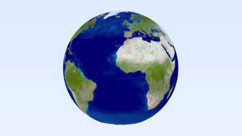

A very common feature in any sort of rendering engine is the ability to map an image onto surfaces.
Generally there are multiple parameters for how surfaces coordinates should map onto an image, for example wrapping vs clamping, but for this implementation we will take a simple approach.

### Storing Texture Image Date

First we need to load an image, to do this we will use the [image crate](https://crates.io/crates/image),

```toml
[dependencies]
rand = "0.7.3"
image = "0.23.12" // highlight-line
```

Then define a new struct and store an image:

```rust{numberLines: true}
pub struct ImageTexture {
    img: DynamicImage
}

impl ImageTexture {
    pub fn new(filename: &Path) -> Self {
        ImageTexture {
            img: image::io::Reader::open(filename).unwrap().decode().unwrap()
        }
    }
}
```

Next let's make our `clamp` function a bit more generic:

```rust{numberLines: true}
pub fn clamp<T: PartialOrd>(x: T, min: T, max: T) -> T { // highlight-line
    if x < min {
        min
    } else if x > max {
        max
    } else {
        x
    }
}
```

Then we can use it to implement our `value` function for our `ImageTexture`:

```rust{numberLines: true}
impl Texture for ImageTexture {
    fn value(self: &Self, u: f64, v: f64, _p: &Point3) -> Color {
        let u = clamp(u, 0.0, 1.0);
        let width = self.img.width();
        let i = clamp((u * width as f64) as u32, 0, width - 1);

        let v = 1.0 - clamp(v, 0.0, 1.0);
        let height = self.img.height();
        let j = clamp((v * height as f64) as u32, 0, height - 1);

        let color_scale = 1.0 / 255.0;
        let pixel = self.img.get_pixel(i, j);

        Color::new(color_scale * pixel[0] as f64, color_scale * pixel[1] as f64, color_scale * pixel[2] as f64)
    }
}
```

Finally, let's add an image textured sphere to our scene:

```rust{numberLines: true}
fn earth() -> HittableList {
    let earth_texture = Rc::new(ImageTexture::new(Path::new("earthmap.jpg")));
    let earth_surface = Rc::new(Lambertian::new_from_texture(earth_texture));
    let globe = Rc::new(Sphere::new(Point3::new(0.0, 0.0, 0.0), 2.0, earth_surface));

    let mut world = HittableList::new();
    world.add(globe);

    world
}

...

        3 => { // highlight-line
            world = two_perlin_spheres();
            lookfrom = Point3::new(13.0, 2.0, 3.0);
            lookat = Point3::new(0.0, 0.0, 0.0);
            vfov = 20.0;
            aperture = 0.0;
        },
        4 | _ => {
            world = earth();
            lookfrom = Point3::new(13.0, 2.0, 3.0);
            lookat = Point3::new(0.0, 0.0, 0.0);
            vfov = 20.0;
            aperture = 0.0;
        },

...
```

This will give:



The complete code is [available here](https://github.com/austindoupnik/ray-tracing-in-one-weekend-with-rust/tree/v0.0.1-the-next-week-chapter.6).
