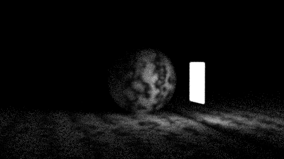

In this chapter we will augment materials to allow them to emit light, additionally we will add rectangles and begin working on a scene to render a [cornell box](https://en.wikipedia.org/wiki/Cornell_box).

### Emissive Materials

First we add a new function to our `Material` trait allowing materials to emit some color.
We provide a default implementation to avoid updating all the existing materials.

```rust{numberLines: true}
pub trait Material {
    fn scatter(&self, r_in: &Ray, rec: &HitRecord, attenuation: &mut Color, scattered: &mut Ray) -> bool;

    fn emitted(&self, _u: f64, _v: f64, _p: &Point3) -> Color { // highlight-line
        Color::new(0.0, 0.0, 0.0) // highlight-line
    } // highlight-line
}
```

Next we add a new material for diffuse lighting:

```rust{numberLines: true}
pub struct DiffuseLight {
    emit: Rc<dyn Texture>,
}

impl DiffuseLight {
    pub fn new(emit: Rc<dyn Texture>) -> Self {
        DiffuseLight {
            emit
        }
    }
}

impl Material for DiffuseLight {
    fn scatter(&self, _r_in: &Ray, _rec: &HitRecord, _attenuation: &mut Color, _scattered: &mut Ray) -> bool {
        false
    }

    fn emitted(&self, u: f64, v: f64, p: &Point3) -> Color {
        self.emit.value(u, v, p)
    }
}
```

### Adding Background Color to the Ray Color Function

Next we will update our `ray_color` function to use an all black background:

```rust{numberLines: true}
fn ray_color(r: &Ray, background: &Color, world: &dyn Hittable, depth: u32) -> Color { // highlight-line
    if depth <= 0 {
        return Color::new(0.0, 0.0, 0.0);
    }

    let mut rec = HitRecord::new();
    if !world.hit(r, 0.001, f64::INFINITY, &mut rec) { // highlight-line
        return *background; // highlight-line
    } // highlight-line

    let mut scattered = Ray::new(Point3::new(0.0, 0.0, 0.0), Vec3::new(0.0, 0.0, 0.0), 0.0); // highlight-line
    let mut attenuation = Color::new(0.0, 0.0, 0.0); // highlight-line
    let emitted = rec.mat_ptr.as_ref().unwrap().emitted(rec.u, rec.v, &rec.p); // highlight-line

    if !rec.mat_ptr.as_ref().unwrap().scatter(r, &rec, &mut attenuation, &mut scattered) { // highlight-line
        return emitted; // highlight-line
    } // highlight-line

    emitted + attenuation * ray_color(&scattered, background, world, depth - 1) // highlight-line
}

...

fn main() {
    let aspect_ratio; // highlight-line

    let image_width; // highlight-line
    let samples_per_pixel; // highlight-line
    let max_depth = 50;

    let world;
    let lookfrom;
    let lookat;
    let vfov;
    let aperture;
    let background; // highlight-line

    match 0 {
        1 => {
            world = random_scene();
            aspect_ratio = 16.0 / 9.0; // highlight-line
            image_width = 400; // highlight-line
            samples_per_pixel = 100; // highlight-line
            background = Color::new(0.70, 0.80, 1.00); // highlight-line
            lookfrom = Point3::new(13.0, 2.0, 3.0);
            lookat = Point3::new(0.0, 0.0, 0.0);
            vfov = 20.0;
            aperture = 0.1;
        }
        2 => {
            world = two_spheres();
            aspect_ratio = 16.0 / 9.0; // highlight-line
            image_width = 400; // highlight-line
            samples_per_pixel = 100; // highlight-line
            background = Color::new(0.70, 0.80, 1.00); // highlight-line
            lookfrom = Point3::new(13.0, 2.0, 3.0);
            lookat = Point3::new(0.0, 0.0, 0.0);
            vfov = 20.0;
            aperture = 0.0;
        }
        3 => {
            world = two_perlin_spheres();
            aspect_ratio = 16.0 / 9.0; // highlight-line
            image_width = 400; // highlight-line
            samples_per_pixel = 100; // highlight-line
            background = Color::new(0.70, 0.80, 1.00); // highlight-line
            lookfrom = Point3::new(13.0, 2.0, 3.0);
            lookat = Point3::new(0.0, 0.0, 0.0);
            vfov = 20.0;
            aperture = 0.0;
        }
        4 => {
            world = earth();
            aspect_ratio = 16.0 / 9.0; // highlight-line
            image_width = 400; // highlight-line
            samples_per_pixel = 100; // highlight-line
            background = Color::new(0.70, 0.80, 1.00); // highlight-line
            lookfrom = Point3::new(13.0, 2.0, 3.0);
            lookat = Point3::new(0.0, 0.0, 0.0);
            vfov = 20.0;
            aperture = 0.0;
        }
        5 | _ => {
            world = simple_light();
            aspect_ratio = 16.0 / 9.0; // highlight-line
            image_width = 400; // highlight-line
            samples_per_pixel = 400; // highlight-line
            background = Color::new(0.0, 0.0, 0.0); // highlight-line
            lookfrom = Point3::new(26.0, 3.0, 6.0);
            lookat = Point3::new(0.0, 2.0, 0.0);
            vfov = 20.0;
            aperture = 0.1;
        }
    }
    
    
    let image_height = (image_width as f64 / aspect_ratio) as u32; // highlight-line

    let dist_to_focus = 10.0;
    let vup = Vec3::new(0.0, 1.0, 0.0);
    let cam = Camera::new(lookfrom, lookat, vup, vfov, aspect_ratio, aperture, dist_to_focus, 0.0, 1.0);

    print!("P3\n{} {}\n255\n", image_width, image_height);

    for j in (0..image_height).rev() {
        eprint!("\rScanlines remaining: {} ", j);
        for i in 0..image_width {
            let mut pixel_color = Color::new(0.0, 0.0, 0.0);
            for _ in 0..samples_per_pixel {
                let u = (i as f64 + random::random()) / (image_width - 1) as f64;
                let v = (j as f64 + random::random()) as f64 / (image_height - 1) as f64;
                let r = cam.get_ray(u, v);
                pixel_color += ray_color(&r, &background, &world, max_depth); // highlight-line
            }
            write_color(io::stdout().borrow_mut(), pixel_color, samples_per_pixel).unwrap();
        }
    }

    eprint!("\nDone.\n");
```

### Creating Rectangle Objects

Moving on to axis-aligned rectangles, we will start with rectangles in the XY plane.

```rust{numberLines: true}
pub struct XyRect {
    mp: Rc<dyn Material>,

    x0: f64,
    x1: f64,
    y0: f64,
    y1: f64,

    k: f64,
}

impl XyRect {
    pub fn new(x0: f64, x1: f64, y0: f64, y1: f64, k: f64, mp: Rc<dyn Material>) -> Self {
        XyRect {
            x0,
            x1,
            y0,
            y1,
            k,
            mp,
        }
    }
}

impl Hittable for XyRect {
    fn hit(&self, r: &Ray, t_min: f64, t_max: f64, rec: &mut HitRecord) -> bool {
        let t = (self.k - r.origin().z()) / r.direction().z();
        if t < t_min || t > t_max {
            return false;
        }

        let x = r.origin().x() + t * r.direction().x();
        let y = r.origin().y() + t * r.direction().y();
        if x < self.x0 || x > self.x1 || y < self.y0 || y > self.y1 {
            return false;
        }

        rec.u = (x - self.x0) / (self.x1 - self.x0);
        rec.v = (y - self.y0) / (self.y1 - self.y0);
        rec.t = t;
        rec.set_face_normal(r, &Vec3::new(0.0, 0.0, 1.0));
        rec.mat_ptr = Option::Some(self.mp.clone());
        rec.p = r.at(t);

        true
    }

    fn bounding_box(&self, _time0: f64, _time1: f64, output_box: &mut Aabb) -> bool {
        *output_box = Aabb::new(Point3::new(self.x0, self.y0, self.k - 0.0001), Point3::new(self.x1, self.y1, self.k + 0.0001));
        true
    }
}
```

### Turning Objects into Lights

Let's create a scene with a rectangle emitting light.

```rust{numberLines: true}
fn simple_light() -> HittableList {
    let pertext = Rc::new(NoiseTexture::new(4.0));

    let mut world = HittableList::new();
    world.add(Rc::new(Sphere::new(Point3::new(0.0, -1000.0, 0.0), 1000.0, Rc::new(Lambertian::new_from_texture(pertext.clone())))));
    world.add(Rc::new(Sphere::new(Point3::new(0.0, 2.0, 0.0), 2.0, Rc::new(Lambertian::new_from_texture(pertext.clone())))));

    world.add(Rc::new(XyRect::new(3.0, 5.0, 1.0, 3.0, -2.0, Rc::new(DiffuseLight::new(Rc::new(SolidColor::new(Color::new(4.0, 4.0, 4.0))))))));

    world
}
```

This will give:



We can also try creating a sphere which will emit light.

```rust{numberLines: true}
fn simple_light() -> HittableList {
    let pertext = Rc::new(NoiseTexture::new(4.0));

    let mut world = HittableList::new();
    world.add(Rc::new(Sphere::new(Point3::new(0.0, -1000.0, 0.0), 1000.0, Rc::new(Lambertian::new_from_texture(pertext.clone())))));
    world.add(Rc::new(Sphere::new(Point3::new(0.0, 2.0, 0.0), 2.0, Rc::new(Lambertian::new_from_texture(pertext.clone())))));
    world.add(Rc::new(Sphere::new(Point3::new(0.0, 7.0, 0.0), 2.0, Rc::new(DiffuseLight::new(Rc::new(SolidColor::new(Color::new(4.0, 4.0, 4.0))))))));

    world.add(Rc::new(XyRect::new(3.0, 5.0, 1.0, 3.0, -2.0, Rc::new(DiffuseLight::new(Rc::new(SolidColor::new(Color::new(4.0, 4.0, 4.0))))))));

    world
}
```

The result:


### More Axis-Aligned Rectangles

Let's add XZ and YZ rectangles.

```rust{numberLines: true}
pub struct XzRect {
    mp: Rc<dyn Material>,

    x0: f64,
    x1: f64,
    z0: f64,
    z1: f64,

    k: f64,
}

impl XzRect {
    pub fn new(x0: f64, x1: f64, z0: f64, z1: f64, k: f64, mp: Rc<dyn Material>) -> Self {
        XzRect {
            x0,
            x1,
            z0,
            z1,
            k,
            mp,
        }
    }
}

impl Hittable for XzRect {
    fn hit(&self, r: &Ray, t_min: f64, t_max: f64, rec: &mut HitRecord) -> bool {
        let t = (self.k - r.origin().y()) / r.direction().y();
        if t < t_min || t > t_max {
            return false;
        }

        let x = r.origin().x() + t * r.direction().x();
        let z = r.origin().z() + t * r.direction().z();
        if x < self.x0 || x > self.x1 || z < self.z0 || z > self.z1 {
            return false;
        }

        rec.u = (x - self.x0) / (self.x1 - self.x0);
        rec.v = (z - self.z0) / (self.z1 - self.z0);
        rec.t = t;
        rec.set_face_normal(r, &Vec3::new(0.0, 1.0, 0.0));
        rec.mat_ptr = Option::Some(self.mp.clone());
        rec.p = r.at(t);

        true
    }

    fn bounding_box(&self, _time0: f64, _time1: f64, output_box: &mut Aabb) -> bool {
        *output_box = Aabb::new(Point3::new(self.x0, self.z0, self.k - 0.0001), Point3::new(self.x1, self.z1, self.k + 0.0001));
        true
    }
}

pub struct YzRect {
    mp: Rc<dyn Material>,

    y0: f64,
    y1: f64,
    z0: f64,
    z1: f64,

    k: f64,
}

impl YzRect {
    pub fn new(y0: f64, y1: f64, z0: f64, z1: f64, k: f64, mp: Rc<dyn Material>) -> Self {
        YzRect {
            y0,
            y1,
            z0,
            z1,
            k,
            mp,
        }
    }
}

impl Hittable for YzRect {
    fn hit(&self, r: &Ray, t_min: f64, t_max: f64, rec: &mut HitRecord) -> bool {
        let t = (self.k - r.origin().x()) / r.direction().x();
        if t < t_min || t > t_max {
            return false;
        }

        let y = r.origin().y() + t * r.direction().y();
        let z = r.origin().z() + t * r.direction().z();
        if y < self.y0 || y > self.y1 || z < self.z0 || z > self.z1 {
            return false;
        }

        rec.u = (y - self.y0) / (self.y1 - self.y0);
        rec.v = (z - self.z0) / (self.z1 - self.z0);
        rec.t = t;
        rec.set_face_normal(r, &Vec3::new(1.0, 0.0, 0.0));
        rec.mat_ptr = Option::Some(self.mp.clone());
        rec.p = r.at(t);

        true
    }

    fn bounding_box(&self, _time0: f64, _time1: f64, output_box: &mut Aabb) -> bool {
        *output_box = Aabb::new(Point3::new(self.y0, self.z0, self.k - 0.0001), Point3::new(self.y1, self.z1, self.k + 0.0001));
        true
    }
}
```

### Creating an Empty “Cornell Box”

Finally, we can create an empty "cornell box".

```rust{numberLines: true}
fn cornell_box() -> HittableList {
    let red = Rc::new(Lambertian::new(Color::new(0.65, 0.05, 0.05)));
    let white = Rc::new(Lambertian::new(Color::new(0.73, 0.73, 0.73)));
    let green = Rc::new(Lambertian::new(Color::new(0.12, 0.45, 0.15)));

    let light = Rc::new(DiffuseLight::new(Rc::new(SolidColor::new(Color::new(15.0, 15.0, 15.0)))));

    let mut world = HittableList::new();

    world.add(Rc::new(YzRect::new(0.0, 555.0, 0.0, 555.0, 555.0, green)));
    world.add(Rc::new(YzRect::new(0.0, 555.0, 0.0, 555.0, 0.0, red)));

    world.add(Rc::new(XzRect::new(213.0, 343.0, 227.0, 332.0, 554.0, light)));
    world.add(Rc::new(XzRect::new(0.0, 555.0, 0.0, 555.0, 0.0, white.clone())));
    world.add(Rc::new(XzRect::new(0.0, 555.0, 0.0, 555.0, 555.0, white.clone())));

    world.add(Rc::new(XyRect::new(0.0, 555.0, 0.0, 555.0, 555.0, white.clone())));

    world
}
```

This looks like:


The complete code is [available here](https://github.com/austindoupnik/ray-tracing-in-one-weekend-with-rust/tree/v0.0.1-the-next-week-chapter.7).
